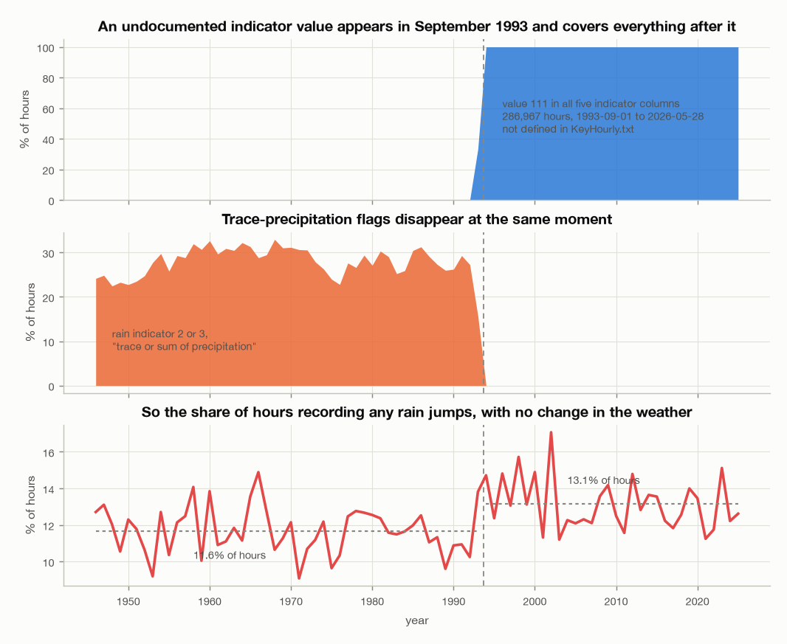
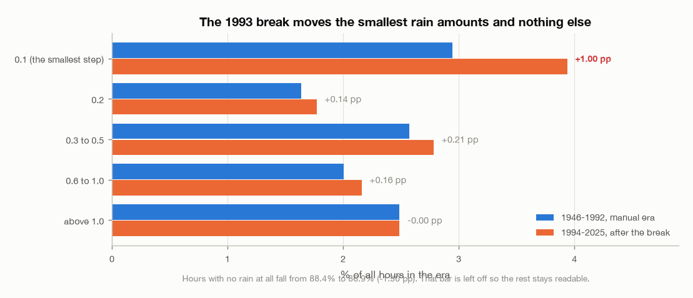
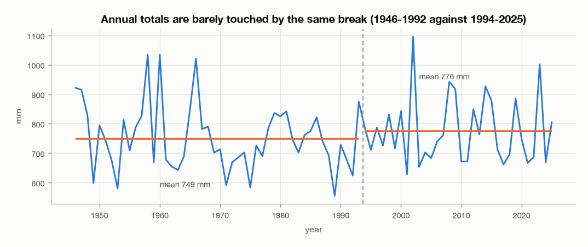
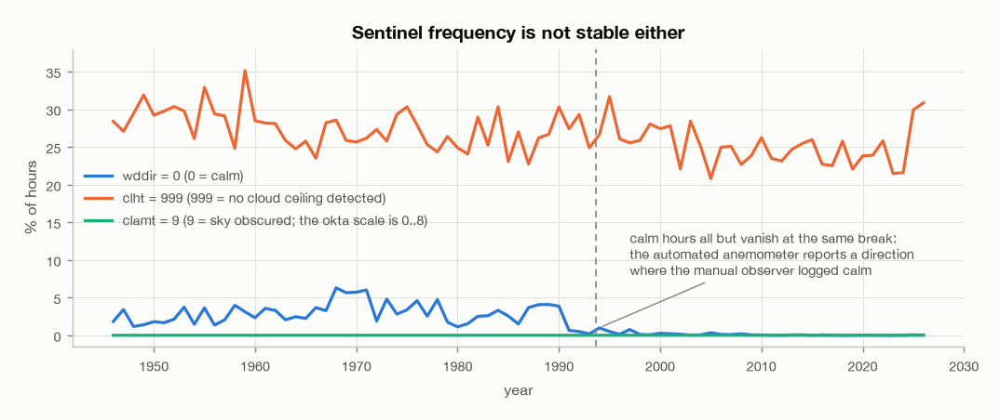
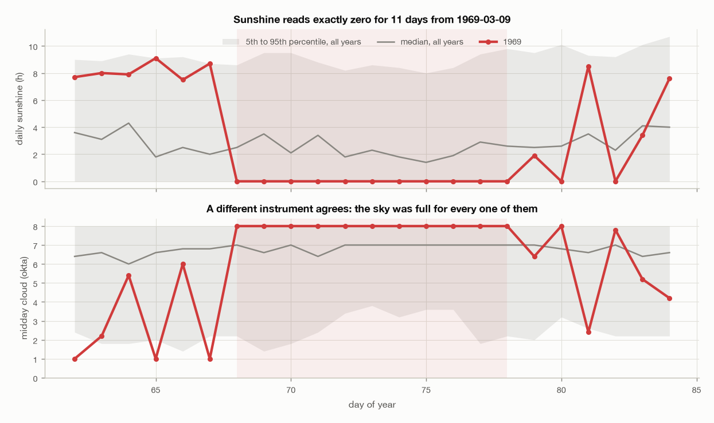
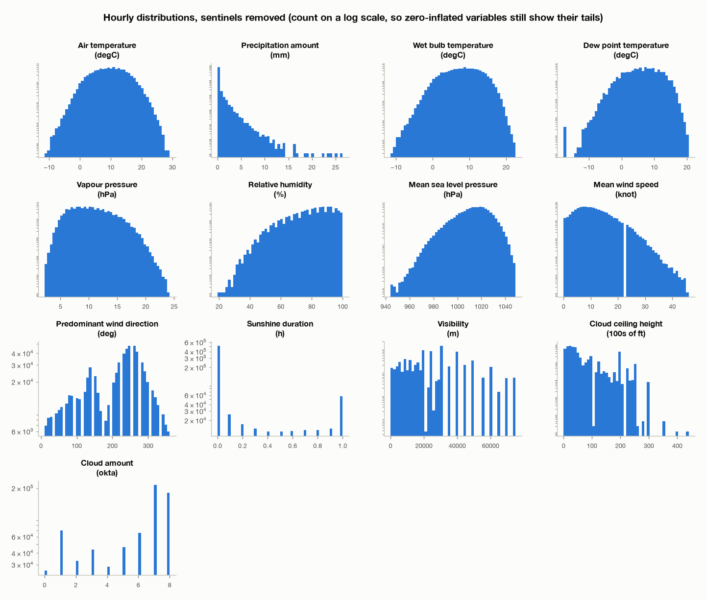
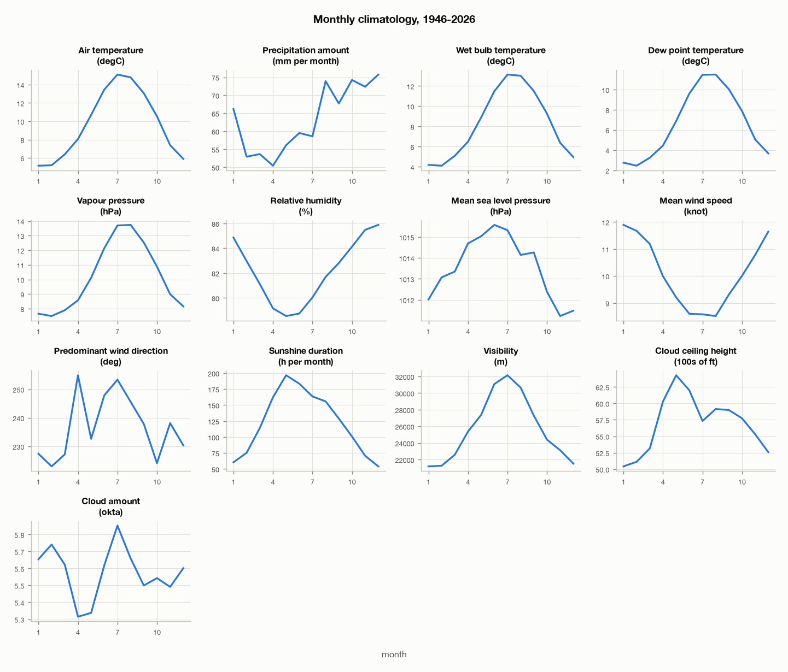
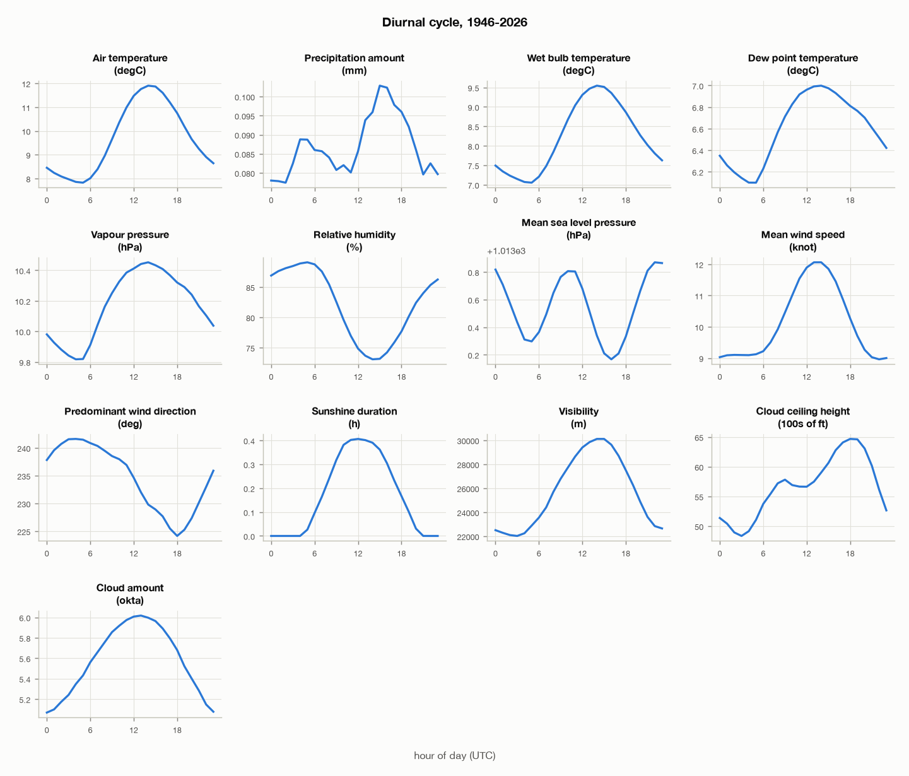
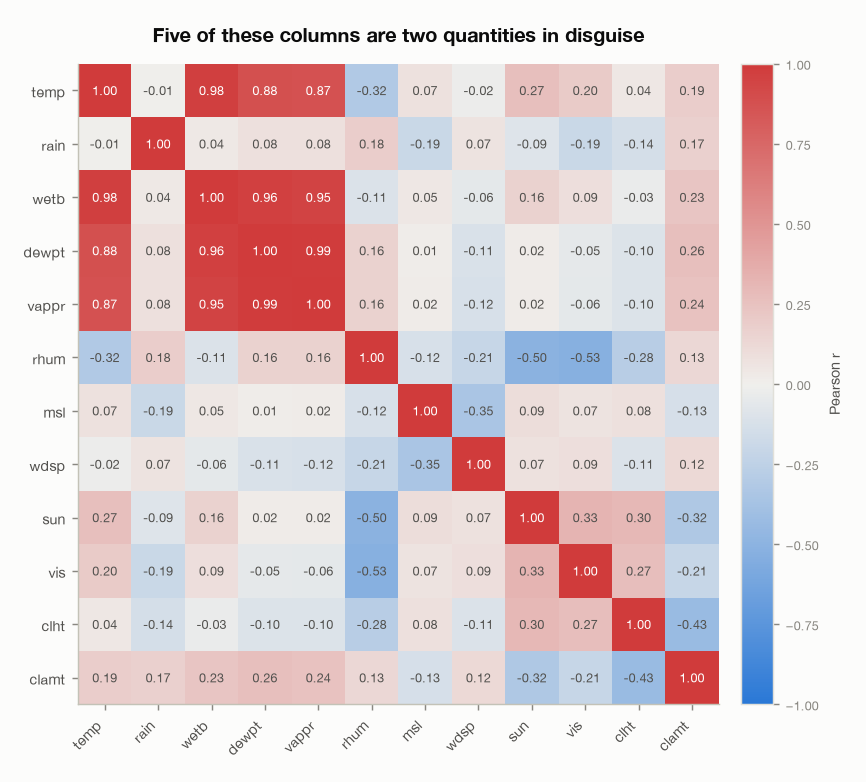

# Dublin Airport hourly weather, 1946-2026: a complete data review

The first of three documents. This one establishes what the data is and, more
usefully, where it cannot be trusted. The temperature and precipitation
documents cite the register in [section 10](#10-data-quality-register) rather
than repeat it.

Everything here is computed by `EDA/scripts/eda_report.py`. Every number quoted
lives in a CSV under `EDA/stats/`, so a re-run that changes a figure shows up as
a git diff instead of quietly disagreeing with the prose.

```
uv run EDA/scripts/eda_report.py --section review
```

## The short version

The series is structurally close to perfect and historically messy, and those
are different things.

- **Structurally**: 706,369 hourly rows, 1946-01-01 to 2026-08-01 UTC, with no
  duplicate timestamps, no missing timestamps and 306 null cells in the entire
  file. Nothing needs reindexing, gap-filling or de-duplicating.
- **Historically**: the station changed how it observes in **September 1993**,
  and the change is visible in eleven of the thirteen variables. It is not
  documented anywhere in the material that ships with the data.
- The break is **fatal to some statistics and harmless to others**, and which is
  which is not obvious. Hours recording any rain step up by 1.5 percentage
  points across it. Hours recording more than 1 mm of rain step by 0.0002.

- **The file is what it says it is.** Recomputing Met Éireann's published
  1991-2020 Dublin Airport normals from these rows reproduces the annual
  rainfall total to within 0.03% and the annual mean temperature to within the
  rounding of the published value. See [section 7.1](#71-checking-the-file-against-met-éireanns-published-normals).

The rest of this document is the evidence for those claims.

## 1. Provenance

| Field | Value |
|---|---|
| Station | Dublin Airport, 53.428 N, -6.241 E, 71 m |
| Period | 1946-01-01 00:00 to 2026-08-01 00:00 UTC |
| Rows | 706,369 |
| Source file | `data/dublin_airport-meteo-1946-2026-data.csv.gz` |
| SHA-256 | `63d2b9764afb53a0611d6759b427c46e5afa25afd4226c82781e8ff15620084b` |
| Licence | Met Éireann, CC BY 4.0 |

Timestamps are UTC, so the diurnal cycle in [section 8](#8-diurnal-cycle) is in
UTC and runs about 25 minutes behind local solar time at this longitude, plus an
hour again during Irish Summer Time.

2026 is a partial year: it ends on 1 August with 5,089 hours. It is excluded
from every annual statistic and every trend in all three documents.

Machine-readable: `EDA/stats/01-source.csv`.

## 2. Schema

The file has 21 columns for 13 measured variables. The remainder are five
indicator flags, two SYNOP weather codes and the timestamp.

**The header is ambiguous and has to be resolved before anything else.** Five
columns are all literally named `ind`, so any reader that keys by name loses
which variable each one qualifies. Position resolves it: each `ind` immediately
precedes the variable it belongs to, except the two wind flags which precede
`wdsp` and `wddir` respectively.

| Column | Role | Meaning | Unit |
|---|---|---|---|
| `date` | timestamp | Date and time | UTC |
| `ind` (1st) | indicator | qualifies `rain` | code |
| `rain` | variable | Precipitation amount | mm |
| `ind` (2nd) | indicator | qualifies `temp` | code |
| `temp` | variable | Air temperature | °C |
| `ind` (3rd) | indicator | qualifies `wetb` | code |
| `wetb` | variable | Wet bulb temperature | °C |
| `dewpt` | variable | Dew point temperature | °C |
| `vappr` | variable | Vapour pressure | hPa |
| `rhum` | variable | Relative humidity | % |
| `msl` | variable | Mean sea level pressure | hPa |
| `ind` (4th) | indicator | qualifies `wdsp` | code |
| `wdsp` | variable | Mean wind speed | knot |
| `ind` (5th) | indicator | qualifies `wddir` | code |
| `wddir` | variable | Predominant wind direction | ° |
| `ww` | synop code | Present weather | code |
| `w` | synop code | Past weather | code |
| `sun` | variable | Sunshine duration | h |
| `vis` | variable | Visibility | m |
| `clht` | variable | Cloud ceiling height | 100s of ft |
| `clamt` | variable | Cloud amount | okta |

The two SYNOP code columns are categorical weather codes, not measurements. They
are catalogued here and not analysed further; neither the temperature nor the
precipitation document uses them.

Machine-readable: `EDA/stats/01-schema.csv`.

## 3. Completeness

Checked rather than assumed, because a complete-looking file with silent gaps is
the expensive kind of mistake.

| Check | Result |
|---|---|
| Expected hourly timestamps | 706,369 |
| Rows present | 706,369 |
| Distinct timestamps | 706,369 |
| Duplicate timestamps | 0 |
| Missing timestamps | 0 |
| Distinct gaps between consecutive rows | one hour, 706,368 times |

Every consecutive pair of rows is exactly one hour apart across eighty years.
There is no coverage chart in this document because a chart of that fact is
eighty identical bars.

Nulls are almost nonexistent, and where they occur they are isolated:

| Variable | Null cells |
|---|---|
| `vis` | 255 |
| `clht` | 24 |
| `clamt` | 24 |
| `vappr` | 1 |
| `rhum` | 1 |
| `wddir` | 1 |

That is 306 nulls in 9.2 million measured cells. **The nulls are not the
completeness problem in this dataset.** The next section is.

Machine-readable: `EDA/stats/01-continuity.csv`, `EDA/stats/01-completeness.csv`.

## 4. The September 1993 break

This is the central finding of the review.

### 4.1 An undocumented indicator value covers 40% of the file

All five indicator columns simultaneously carry the value **111** for 286,967
rows, in one contiguous run:

| Block | Start (UTC) | End (UTC) | Hours |
|---|---|---|---|
| 1 | 1993-09-01 01:00 | 2026-05-21 20:00 | 286,820 |
| 2 | 2026-05-21 22:00 | 2026-05-28 00:00 | 147 |

The two blocks are separated by a single hour. The five columns are never 111
independently: on every one of those rows, all five are 111 together.

**111 is not defined anywhere in Met Éireann's own key file**
([KeyHourly.txt](https://www.met.ie/cms/assets/uploads/2018/05/KeyHourly.txt)),
which documents codes 0 to 7 only. Nor is it in the info file shipped beside the
data, which says only "ind: Indicator".

The natural reading is that 111 marks the automated observation era and the
codes before it belong to manual synoptic observation. **That reading is an
inference, not a documented fact, and this document does not rely on it.** What
the analysis relies on is the measured behaviour either side of the boundary,
which is set out below and does not depend on knowing why.

Two further gaps in the documentation, smaller but worth recording:

- `ind_wdsp` and `ind_wddir` use codes **0 and 1** for 42% of all rows. The key
  file defines only 2, 4, 6 and 7 for the wind indicators.
- `ind_wetb` uses code 6 on four rows. The key file defines 0 to 5 for wet bulb.

Machine-readable: `EDA/stats/01-indicator-codes.csv`,
`EDA/stats/01-undocumented-blocks.csv`.

### 4.2 Trace precipitation flags vanish at the same moment

The key file defines rain indicator 2 as "trace or sum of precipitation" and 3 as
"trace or sum of deposition". Together they cover a quarter to a third of every
hour in the manual era, and effectively nothing afterwards.



Those flagged rows are 97.6% and 99.96% zero-valued respectively, so they are
overwhelmingly **trace observations recorded as 0.0 mm**: the observer saw
precipitation too slight to measure and logged it as such. After the break that
distinction is not recorded at all.

The bottom panel shows what this does. The share of hours recording any rain
steps from 11.6% to 13.1% with no change in the weather.

### 4.3 But the break only moves the smallest amounts

The step above looks alarming until the amounts are binned, at which point it
turns out to be confined to the bottom of the scale.



| Hourly rain | 1946-1992 | 1994-2025 | Step |
|---|---|---|---|
| exactly 0.0 mm | 88.36% | 86.86% | -1.50 pp |
| 0.1 mm | 2.94% | 3.94% | **+1.00 pp** |
| 0.2 mm | 1.64% | 1.77% | +0.14 pp |
| 0.3 to 0.5 mm | 2.57% | 2.78% | +0.21 pp |
| 0.6 to 1.0 mm | 2.00% | 2.16% | +0.16 pp |
| above 1.0 mm | 2.49% | 2.49% | **-0.0002 pp** |

Two thirds of the step sits in the single 0.1 mm bin, and hours of meaningful
rain are identical to four decimal places. Both eras record to the same 0.1 mm
resolution; the smallest positive value on record is 0.1 mm in both.

The same question asked of daily totals, which is what the precipitation
document actually uses:

| Daily threshold | 1946-1992 | 1994-2025 | Step |
|---|---|---|---|
| at or above 0.2 mm | 50.6% | 54.0% | +3.4 pp |
| at or above 1 mm | 35.4% | 37.4% | +2.0 pp |
| at or above 5 mm | 13.1% | 13.3% | +0.2 pp |
| at or above 10 mm | 5.1% | 5.2% | +0.1 pp |
| at or above 20 mm | 1.17% | 1.15% | -0.02 pp |
| mean wet-day amount | 5.58 mm | 5.45 mm | -0.13 mm |
| mean annual total | 749.3 mm | 775.7 mm | +26.4 mm |

**The break is a detection-threshold change, not a measurement change.** Wet-day
counts at low thresholds are contaminated by it; heavy-rain counts, intensities
and totals are not.

Annual totals cross the boundary intact:



Machine-readable: `EDA/stats/01-rain-granularity.csv`,
`EDA/stats/01-rain-daily-thresholds.csv`, `EDA/stats/01-indicator-era.csv`.

### 4.4 Which variables the break touches, and how hard

Raw differences across the break are not comparable between a pressure in hPa
and a cloud amount in oktas, so the step is also given in units of each
variable's own year-to-year standard deviation. That is the number that says
whether a step is big enough to contaminate a trend.

| Quantity | 1946-1992 | 1994-2025 | Step | Step / annual SD |
|---|---|---|---|---|
| Hours flagged trace (%) | 28.10 | 0.00 | -28.10 | **-2.01** |
| Hours recorded as calm (%) | 2.93 | 0.14 | -2.80 | **-1.59** |
| Cloud ceiling height (100s ft) | 52.10 | 63.80 | +11.70 | **+1.57** |
| Visibility (m) | 24,589 | 27,353 | +2,764 | **+1.18** |
| Dew point temperature (°C) | 6.36 | 6.95 | +0.59 | +1.15 |
| Vapour pressure (hPa) | 10.01 | 10.40 | +0.39 | +1.15 |
| Hours recording any rain (%) | 11.64 | 13.14 | +1.50 | +0.99 |
| Relative humidity (%) | 81.43 | 83.22 | +1.79 | +0.95 |
| Wet bulb temperature (°C) | 8.05 | 8.47 | +0.42 | +0.95 |
| Hours with no cloud ceiling (%) | 27.55 | 25.01 | -2.55 | -0.90 |
| **Air temperature (°C)** | **9.52** | **9.85** | **+0.33** | **+0.68** |
| Mean wind speed (knot) | 9.99 | 10.29 | +0.31 | +0.39 |
| Sunshine duration (h/year) | 1,455 | 1,490 | +36 | +0.32 |
| Precipitation amount (mm/year) | 749.3 | 775.7 | +26.4 | +0.23 |
| Mean sea level pressure (hPa) | 1013.65 | 1013.39 | -0.26 | -0.17 |
| Cloud amount (okta) | 5.584 | 5.572 | -0.012 | -0.07 |
| Hours recording over 1 mm rain (%) | 2.4878 | 2.4876 | -0.0002 | **-0.0005** |

**This is a screening table, not a verdict.** A real instrument step and a real
climate trend both put a difference in this column, and nothing here separates
them. Three groups come out of it:

1. **Almost certainly instrumental.** Trace flags and calm hours are definitional
   changes in what gets recorded. Cloud ceiling and visibility move more than a
   standard deviation in the direction a laser ceilometer and an automated
   visibility sensor would move them against a human observer's estimate.
2. **Genuinely ambiguous.** Temperature, dew point, vapour pressure and humidity
   all step upward. Warming over a 32-year gap is real and would produce exactly
   this, and so would a sensor change. The temperature document resolves this by
   fitting the two sub-periods separately.
3. **Untouched.** Pressure, cloud amount and hours of rain above 1 mm do not move.
   That the heavy-rain measure is null to four decimal places while the trace
   measure moves two standard deviations is the clearest evidence that the break
   is a detection-threshold effect.

Machine-readable: `EDA/stats/01-break-register.csv`.

## 5. Sentinels and suspicious zeros

### 5.1 Sentinels

Three variables carry a value that is a real observation but not a measurement
on the variable's own scale. They are excluded from every mean, range and
histogram in these documents.

| Variable | Sentinel | Meaning | Rows | Share |
|---|---|---|---|---|
| `clht` | 999 | no cloud ceiling detected | 187,417 | 26.53% |
| `wddir` | 0 | calm, which is not a direction and is not north | 12,472 | 1.77% |
| `clamt` | 9 | sky obscured; the okta scale is 0 to 8 | 1 | 0.00% |

Including `clht` 999 in a mean would put the average cloud base at 30,000 feet.
Treating `wddir` 0 as north would report 12,472 calm hours as a northerly.

Their frequency is not stable over time, which is a finding in itself:



Calm hours run at 2% to 6% before 1993 and essentially vanish afterwards. The
automated anemometer reports a direction where the manual observer logged calm.
**Any analysis of wind direction that crosses 1993 has to handle this**, which is
one reason wind is out of scope for these three documents.

### 5.2 Zeros that could be outages, and are not

A stuck sensor and a genuinely constant quantity look identical in the data. The
screen used here is a run of an identical value longer than the variable can
physically hold steady, with a threshold set per variable because the variables
differ: pressure never repeats to 0.1 hPa for half a day, while humidity
genuinely pins at 100% through a long fog.

The screen's most alarming hit is sunshine duration, which reads **exactly 0.0
for 283 consecutive hours from 2025-02-07**, spanning about twelve February days
of daylight. Two comparable spells turn up in other instrument eras:

| Spell | Days |
|---|---|
| 1969-03-09 to 1969-03-19 | 11 |
| 2025-02-08 to 2025-02-18 | 11 |
| 1987-01-13 to 1987-01-22 | 10 |

Cloud amount, cloud ceiling and rainfall come from different instruments, so
they can settle it. A stuck sunshine sensor would leave them at normal levels; a
fortnight of unbroken overcast pushes them to their extremes together.

| Spell | Days | Midday cloud | Same month, all years | Midday hours below 6 okta | Rain over spell |
|---|---|---|---|---|---|
| 1969-03-09 to 03-19 | 11 | 8.00 okta | 6.10 | 0.0% | 38.5 mm |
| 2025-02-08 to 02-18 | 11 | 7.44 okta | 6.06 | 0.0% | 20.2 mm |
| 1987-01-13 to 01-22 | 10 | 7.96 okta | 5.87 | 0.0% | 22.4 mm |
| 1954-01-18 to 01-25 | 8 | 7.85 okta | 5.87 | 2.5% | 20.1 mm |
| 1957-11-11 to 11-18 | 8 | 7.98 okta | 5.75 | 0.0% | 14.0 mm |
| 1961-11-13 to 11-20 | 8 | 7.73 okta | 5.75 | 0.0% | 0.0 mm |

Every spell checks out. A ceiling was detected in every midday hour of all six,
and rain fell during five.



**Verdict: the zeros are weather, not an outage, and they stay in the analysis.**
One caveat on the corroboration: cloud amount pinned at exactly 8 oktas is
itself a value at the top of its scale, so it is not fully independent evidence.
Rainfall is, and it fell throughout five of the six spells.

The remaining screen hits are all explicable: `clamt` at 8 oktas and `clht` at
999 for days at a time under settled cloud regimes, `rhum` at 100% through
multi-day fog, and `rain` at 0.0 for 717 hours from 1955-07-03, in a summer
Ireland remembers as a drought.

**A related finding that is not a data-quality issue but is easy to mistake for
one.** The share of days recording no sunshine at all has fallen steadily:

| Decade | 1940s | 1950s | 1960s | 1970s | 1980s | 1990s | 2000s | 2010s | 2020s |
|---|---|---|---|---|---|---|---|---|---|
| Days with zero sunshine | 15.5% | 15.5% | 17.3% | 17.6% | 15.9% | 16.6% | 13.1% | 11.0% | 10.2% |

The drop lands either side of the 1993 break, and an electronic sensor will
register a brief weak beam that a Campbell-Stokes card would not have burned.
**This number cannot separate the instrument from the climate and should not be
quoted as a trend.**

Machine-readable: `EDA/stats/01-suspect-runs.csv`,
`EDA/stats/01-zero-sun-spells.csv`, `EDA/stats/01-zero-sun-verified.csv`,
`EDA/stats/01-zero-sun-by-decade.csv`.

## 6. Univariate summary

Sentinels removed. Hourly values, whole record.

| Variable | Unit | n | min | p5 | median | mean | p95 | max | SD | skew |
|---|---|---|---|---|---|---|---|---|---|---|
| `temp` | °C | 706,369 | -11.5 | 1.6 | 9.7 | 9.67 | 17.6 | 29.1 | 4.90 | -0.03 |
| `rain` | mm | 706,369 | 0.0 | 0.0 | 0.0 | 0.087 | 0.5 | 26.5 | 0.42 | 11.01 |
| `wetb` | °C | 706,369 | -11.5 | 0.7 | 8.4 | 8.22 | 15.1 | 22.6 | 4.41 | -0.16 |
| `dewpt` | °C | 706,369 | -17.7 | -1.0 | 6.9 | 6.60 | 13.8 | 20.5 | 4.59 | -0.17 |
| `vappr` | hPa | 706,368 | 2.2 | 5.7 | 9.9 | 10.17 | 15.8 | 24.2 | 3.13 | 0.42 |
| `rhum` | % | 706,368 | 19 | 60 | 84 | 82.11 | 98 | 100 | 11.74 | -0.75 |
| `msl` | hPa | 706,369 | 944.1 | 991.1 | 1014.8 | 1013.55 | 1031.7 | 1048.7 | 12.35 | -0.53 |
| `wdsp` | knot | 706,369 | 0 | 2 | 9 | 10.11 | 20 | 46 | 5.67 | 0.70 |
| `wddir` | ° | 693,896 | 10 | 50 | 230 | 205.9 | 320 | 360 | 84.50 | -0.51 |
| `sun` | h | 706,369 | 0.0 | 0.0 | 0.0 | 0.168 | 1.0 | 1.0 | 0.33 | 1.75 |
| `vis` | m | 706,114 | 5 | 4,000 | 25,000 | 25,688 | 50,000 | 75,000 | 15,177 | 0.64 |
| `clht` | 100s ft | 518,928 | 0 | 5 | 35 | 56.87 | 200 | 440 | 60.89 | 1.73 |
| `clamt` | okta | 706,344 | 0 | 1 | 7 | 5.58 | 8 | 8 | 2.54 | -0.90 |



Four things the distributions show that the table does not.

- **`rain` and `sun` are zero-inflated**, at 88% and 83% zeros respectively. Their
  skew of 11.0 and 1.75 is a consequence, and it is why the precipitation
  document uses a non-parametric trend test alongside least squares. The count
  axis is logarithmic in that figure for the same reason.
- **`wddir` is reported in 10-degree steps** and is strongly bimodal, with the
  prevailing southwesterly at 230 to 270 degrees.
- **`vis` is reported in coarse discrete steps**, not continuously. The spikes at
  10,000, 20,000, 30,000 and 40,000 m are reporting conventions, so a mean
  visibility is a mean over a coded scale rather than over a measurement.
- **`rhum`, `dewpt` and `vappr` show comb artefacts**, regular spikes from
  rounding and from the lookup tables used to derive them.

`temp` is very nearly symmetric, with a skew of -0.03. Its range of -11.5 °C to
29.1 °C is plausible for a maritime station at this latitude and gives no reason
to suspect outliers.

Machine-readable: `EDA/stats/01-univariate.csv`.

## 7. Seasonality



Rain and sunshine are shown as monthly totals; the rest are monthly means.

Nothing here is surprising, which is the point: a variable whose seasonal cycle
did not look like this would be a sign of a mis-parsed column. Temperature, wet
bulb and dew point peak in July, vapour pressure in August. Pressure and wind
speed run opposite: the windiest month is January at 11.9 knots, the calmest
August at 8.5, while pressure is lowest in November and highest in June.
Sunshine peaks in May, two months before temperature, which is the sea's
thermal lag.

| | Wettest | Driest | Sunniest | Dullest |
|---|---|---|---|---|
| Month | December, 75.8 mm | April, 50.4 mm | May, 196.8 h | December, 54.1 h |

Over the whole record the climatology totals 762 mm of rain and 1,466 hours of
sunshine a year.

### 7.1 Checking the file against Met Éireann's published normals

Everything else in this review checks the data against itself, which cannot
catch a misread unit, a mis-assigned column or a wrong aggregation rule. Those
produce a perfectly self-consistent wrong answer. Recomputing Met Éireann's
own published Dublin Airport 1991-2020 averages from this file is the one test
that can.

| Quantity | This file | Met Éireann published | Difference |
|---|---|---|---|
| Rainfall, annual total | 772.30 mm | 772.50 mm | **-0.03%** |
| Air temperature, annual mean | 9.756 °C | 9.7 °C | +0.06 °C |
| Rainfall, worst-matching month (September) | 61.40 mm | 63.30 mm | -3.0% |
| Rainfall, best-matching month (March) | 51.47 mm | 51.40 mm | +0.13% |

The annual rainfall total agrees to 0.2 mm in 772, and the annual mean
temperature agrees to within the rounding of the published value. Every month is
inside 3% and ten of the twelve are inside 1.5%.

**This is the strongest evidence in the review that the parsing, the units, the
resolution of the five duplicate `ind` columns and the sum-versus-mean
aggregation rules are all correct.** The residual month-level differences are
expected: the published normals are computed from Met Éireann's own quality-
controlled daily series, not by summing this hourly file.

Sunshine cannot be checked this way. The published table has a sunshine section
but its rows are empty.

Machine-readable: `EDA/stats/01-external-validation.csv`.

Machine-readable: `EDA/stats/01-monthly-climatology.csv`.


## 8. Diurnal cycle



Times are UTC. Temperature peaks at 14h and bottoms at 5h; relative humidity
peaks at 5h and bottoms at 14h, exactly inverted, since it is a ratio against a
temperature-dependent capacity. Sunshine traces the daylight envelope and peaks
at 12h.

**The pressure panel is worth a second look.** It has two maxima and two minima
a day rather than one of each: the semidiurnal atmospheric tide, a real
global phenomenon driven by solar heating of stratospheric ozone. Its amplitude
here is about 0.6 hPa. Nothing in the processing could manufacture it, so its
presence is independent evidence that the pressure column is intact and
correctly timestamped.

This figure has a second job: a variable whose reporting hours changed over the
record would show up here as a step or a spike, and none does.

Machine-readable: `EDA/stats/01-diurnal-climatology.csv`.

## 9. Correlation



Pearson correlation on hourly values. Wind direction is excluded because a
linear correlation on a circular quantity is meaningless: 359° and 1° are
adjacent but numerically far apart.

**Five of the thirteen columns are two quantities in disguise.** Temperature, wet
bulb, dew point, vapour pressure and relative humidity are five views of air
temperature and air moisture. Dew point and vapour pressure correlate at 0.99
because one is a deterministic function of the other. Temperature and wet bulb
correlate at 0.98.

For the analysis that follows, this means **`temp` carries the temperature signal
and the other four add almost nothing to it.** The temperature document uses
`temp` alone and does not treat the others as independent confirmation, because
they are not.

The rest is physically ordinary: humidity against sunshine at -0.50, humidity
against visibility at -0.53, cloud amount against cloud ceiling at -0.43, and
pressure against wind speed at -0.35.

Machine-readable: `EDA/stats/01-correlation.csv`.

## 10. Data-quality register

Every issue found, its extent, and what it invalidates. The temperature and
precipitation documents cite this table.

| # | Issue | Extent | Effect |
|---|---|---|---|
| 1 | Undocumented indicator value 111 in all five flag columns | 286,967 rows, 40.6%, 1993-09-01 to 2026-05-28 | Marks an observation-practice change. Not itself an error; the flag cannot be used to filter quality in that era |
| 2 | Trace precipitation flags retired at the same boundary | 28.1% of hours before, 0% after | **Wet-day counts below about 1 mm are not comparable across 1993.** Totals, intensities and heavy-rain counts are |
| 3 | Calm hours stop being recorded | 2.93% before, 0.14% after | **Wind direction statistics are not comparable across 1993.** Wind is out of scope here for this reason |
| 4 | Cloud ceiling steps up 1.57 annual SD | +11.7 (100s ft) | Ceiling trends across the break are not usable |
| 5 | Visibility steps up 1.18 annual SD | +2,764 m | Visibility trends across the break are not usable; the variable is also a coded scale, not a continuous measurement |
| 6 | Temperature and moisture step up 0.7 to 1.2 annual SD | temp +0.33 °C | **Ambiguous between warming and instrument change.** Tested directly in the temperature document by fitting sub-periods separately |
| 7 | Wind indicator codes 0 and 1 undocumented | 42% of rows | No effect on the analyses here |
| 8 | `clht` sentinel 999 | 26.5% of rows | Must be excluded from ranges and means, and its frequency drifts over time |
| 9 | `wddir` sentinel 0 means calm, not north | 1.77% of rows | Must be excluded from any directional mean |
| 10 | `clamt` value 9 means sky obscured | 1 row | Negligible; excluded for correctness |
| 11 | `vis` reported in coarse discrete steps | whole record | A mean visibility is a mean over a coded scale |
| 12 | Days with zero recorded sunshine decline 15.5% to 10.2% | whole record | **Confounded with the instrument change. Not quotable as a trend** |
| 13 | Long zero-sunshine spells | 6 spells of 8 or more days | **Checked and cleared.** Corroborated by cloud and rain from other instruments; genuine overcast |
| 14 | 306 null cells | 0.003% of measured cells | Negligible |
| 15 | 2026 is a partial year | 5,089 hours, ends 1 August | Excluded from all annual statistics and trends |
| 16 | Parsing, units and aggregation | validated externally | **No issue.** Reproduces Met Éireann's published 1991-2020 normals to 0.03% on annual rainfall |

### What this means for the next two documents

- **Temperature** may use the whole record, and must test the 1993 step rather
  than assume it away. Issue 6 is the live threat to every number in it.
- **Precipitation** may use annual and seasonal totals, heavy-rain thresholds,
  intensities and extremes across the whole record. It may not use low-threshold
  wet-day counts, dry-spell lengths or hourly occurrence across 1993 without
  carrying issue 2 inline.
- Daily minimum and maximum in both documents are extremes of hourly readings,
  not the true daily extremes a max/min thermometer records. The difference is
  small but systematic and biases threshold counts slightly downward.

---

*Data: Met Éireann, Dublin Airport hourly observations, licensed
[CC BY 4.0](https://creativecommons.org/licenses/by/4.0/). Met Éireann does not
accept any liability for its use.*
