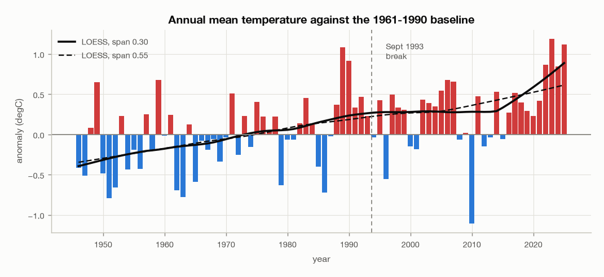
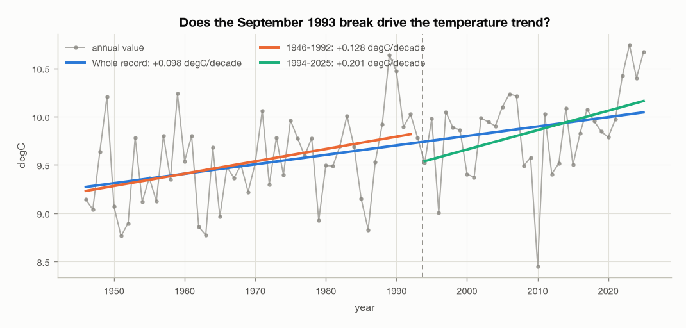
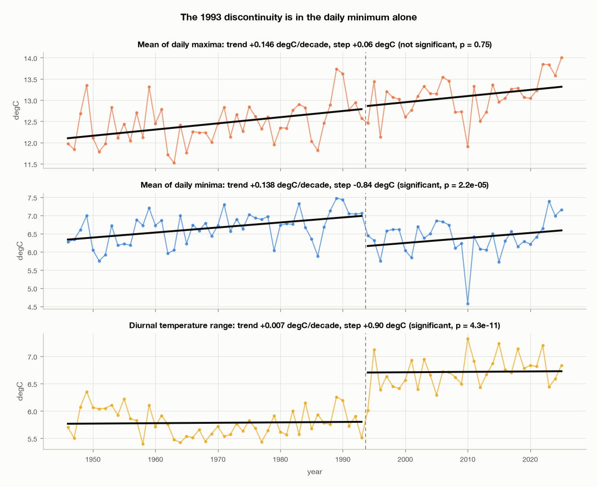
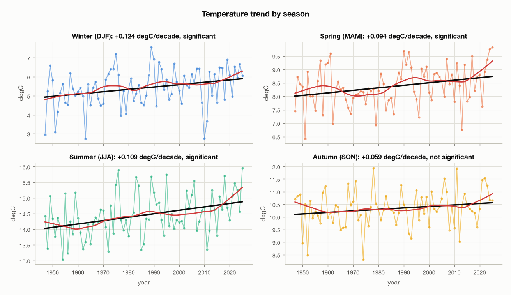
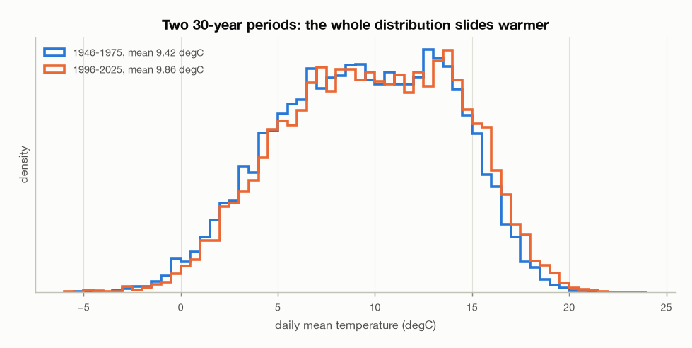
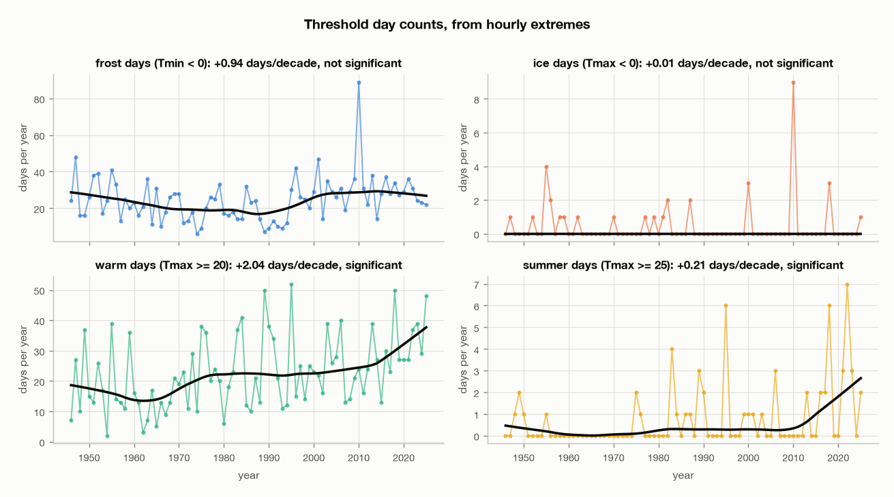

# Temperature at Dublin Airport, 1946-2025: trends and anomalies

The second of three documents. It assumes the data-quality register in
[`01-data-review.md`](01-data-review.md) §10, in particular issue 6: temperature
steps across the September 1993 observation-practice change, and the step is
ambiguous between real warming and an instrument artefact. Resolving that
ambiguity turns out to be most of the work, and it changes three of the
headline answers.

Anomalies are against the **1961-1990** WMO reference period. 2026 is partial
and is excluded throughout, so "the record" means 1946-2025.

```
uv run EDA/scripts/eda_report.py --section temperature
```

## The short version

- **Dublin Airport has warmed by about 0.14 °C per decade**, roughly 1.15 °C
  across the record. Both the parametric and the non-parametric test agree, and
  the result survives the correction for the 1993 break.
- **The naive figure is 0.098 °C per decade, and it is too low.** A discontinuity
  at the break suppresses it. This is the opposite of the direction anyone would
  worry about.
- **Three findings a straightforward analysis would get backwards.** Daily
  minima appear not to warm at all, frost days appear to increase, and the
  diurnal temperature range appears to grow. All three are the same artefact,
  and all three reverse or vanish once it is accounted for.
- **The warming is a shift, not a spreading.** Every percentile of the daily
  distribution moves up by a similar amount; the standard deviation is
  essentially unchanged.
- 2023 is the warmest year on record and 2010 the coldest. Eight of the ten
  warmest years are 1989 or later; the exceptions are 1959 and 1949.

## 1. The annual series



The record runs cool through the 1950s and 1960s, rises through the 1980s and
1990s, flattens through the 2000s and 2010s, and rises sharply in the 2020s. The
2020s are the warmest decade by a clear margin.

| Decade | Mean (°C) | Anomaly vs 1961-1990 | Warmest year | Coldest year |
|---|---|---|---|---|
| 1940s (4 years) | 9.51 | -0.05 | 1949, 10.20 | 1947, 9.04 |
| 1950s | 9.35 | -0.20 | 1959, 10.24 | 1951, 8.76 |
| 1960s | 9.32 | -0.24 | 1961, 9.80 | 1963, 8.77 |
| 1970s | 9.61 | +0.05 | 1971, 10.06 | 1979, 8.92 |
| 1980s | 9.64 | +0.09 | 1989, 10.64 | 1986, 8.83 |
| 1990s | 9.85 | +0.29 | 1990, 10.47 | 1996, 9.00 |
| 2000s | 9.82 | +0.27 | 2006, 10.23 | 2001, 9.37 |
| 2010s | 9.67 | +0.11 | 2014, 10.09 | 2010, 8.45 |
| 2020s (6 years) | **10.33** | **+0.78** | 2023, 10.74 | 2020, 9.79 |

The 2010s dip is largely one year. 2010 is the coldest in the whole record, and
dropping it lifts the decade mean from 9.67 to 9.80 °C, level with the 1990s and
2000s. Whether a genuine pause appears at other stations is not something a
single record can say, and it was not checked.

Machine-readable: `EDA/stats/02-annual-anomaly.csv`, `EDA/stats/02-decades.csv`.

## 2. The 1993 break, and why it has to be handled first

This section exists because getting it wrong changes the sign of three answers.

### 2.1 The wrong way to ask

The obvious approach is to fit the whole record, then each side of the break,
and see whether they agree.

| Fit | Slope (°C/decade) | 95% CI | p |
|---|---|---|---|
| Whole record 1946-2025 | +0.098 | +0.049 to +0.147 | 0.0002 |
| Before the break 1946-1992 | +0.128 | +0.018 to +0.237 | 0.024 |
| After the break 1994-2025 | +0.201 | +0.002 to +0.399 | 0.048 |



All three are positive and significant, which looks reassuring. It is not
informative. A step and a trend are partly confounded: a jump halfway through a
record imitates a slope, and a slope imitates a jump. Comparing sub-period
slopes cannot separate them, and the fact that the whole-record slope is *lower*
than both sub-period slopes is a hint that something is going on that this
framing cannot name.

### 2.2 The right way

Fit the trend and the step together and let them compete for the same variance:

> temperature ~ intercept + trend × year + step × 1[year ≥ Sept 1993]

Applied to every derived temperature series, this localises the discontinuity
precisely.

| Series | Trend with the step in the model | Step at 1993 | Step p |
|---|---|---|---|
| Annual mean | +0.143 °C/decade | -0.25 °C | 0.16 |
| Mean of daily maxima | +0.146 °C/decade | +0.06 °C | 0.75 |
| **Mean of daily minima** | **+0.138 °C/decade** | **-0.84 °C** | **0.00002** |
| **Diurnal temperature range** | **+0.007 °C/decade** | **+0.90 °C** | **4e-11** |



**The discontinuity is in the daily minimum and nowhere else.** The daily maximum
crosses September 1993 without a step worth mentioning. The minimum drops by
0.84 °C. The difference between them therefore jumps by 0.90 °C, and the bottom
panel of that figure shows about as clean a step as a real series ever produces.

### 2.3 Why this is an instrument artefact and not climate

The evidence is circumstantial but it points one way, and the document states it
as an inference rather than a fact.

- It is **instantaneous**, at a boundary already known from the indicator flags
  to be an observation-practice change. Climate does not step in one month.
- It is **asymmetric in a way weather is not**. No physical mechanism lifts the
  afternoon and drops the night on the same date while leaving the daily mean
  statistically unmoved.
- It is **confined to a derived quantity**. The daily minimum is an extreme of
  hourly readings, and extremes are far more sensitive than means to a change in
  sensor response time, screen design or sampling interval. A modern fast
  thermistor tracks a brief pre-dawn dip that a slower liquid-in-glass sensor in
  a larger screen would smooth away.

The alternative, that Dublin's nights genuinely cooled 0.84 °C in one step in
September 1993 while its days did not, has no mechanism and no counterpart in
any regional record.

**What this document does about it.** The annual-mean step is not significant
(p = 0.16), so the headline trend is quoted from the joint model at **+0.143 °C
per decade** with the naive +0.098 stated alongside. Everything derived from the
daily minimum is quoted from the joint model only, with the naive figure shown
so a reader can see the size of the correction.

Machine-readable: `EDA/stats/02-break-test.csv`,
`EDA/stats/02-break-test-all-series.csv`.

## 3. Trends

Three estimates per series. Least squares gives the slope and an interval
widened for lag-1 autocorrelation; Mann-Kendall with Sen's slope is
non-parametric and robust; LOESS shows whether a straight line is the right
description at all. Where they agree the finding is solid.

| Series | OLS (°C/decade) | 95% CI | p | Sen | MK p | Agree |
|---|---|---|---|---|---|---|
| Annual mean | +0.098 | +0.049 to +0.147 | 0.0002 | +0.108 | <1e-4 | yes |
| Winter (DJF) | +0.124 | +0.009 to +0.239 | 0.035 | +0.129 | 0.009 | yes |
| Spring (MAM) | +0.094 | +0.021 to +0.168 | 0.013 | +0.106 | 0.013 | yes |
| Summer (JJA) | +0.109 | +0.045 to +0.173 | 0.001 | +0.107 | 0.002 | yes |
| Autumn (SON) | +0.059 | -0.009 to +0.128 | 0.089 | +0.049 | 0.156 | yes |
| Mean of daily maxima | +0.157 | +0.105 to +0.209 | <1e-4 | +0.168 | <1e-4 | yes |
| Mean of daily minima | -0.013 | -0.083 to +0.057 | 0.71 | -0.010 | 0.70 | yes |
| Diurnal range | +0.170 | +0.107 to +0.232 | <1e-5 | +0.173 | <1e-4 | yes |

**The last two rows of that table are wrong as descriptions of the climate**, and
they are left in because they are what the standard method produces. Corrected
for the 1993 step, daily minima warm at +0.138 °C per decade (p = 0.0008) and
the diurnal range has no trend at all (+0.007 °C per decade, p = 0.77).

Once corrected, the picture is coherent and unremarkable: days and nights are
warming at almost the same rate, +0.146 and +0.138 °C per decade.

Three of the four seasons warm significantly. **Autumn does not** (p = 0.089),
and it is the one season where both tests agree there is no established trend.



Note that the seasonal panels use the naive fit, so their absolute values carry
the same caveat as the annual one. The comparison *between* seasons is unaffected,
since the step applies to all four equally.

Machine-readable: `EDA/stats/02-trends.csv`.

## 4. Is the distribution shifting or spreading?

A mean cannot distinguish the whole distribution sliding warmer from the tails
spreading while the middle stays put. The difference matters far more for
extremes than the change in the mean does. Percentiles of daily mean
temperature, 30 years at each end of the record:

| | mean | SD | p1 | p5 | p25 | p50 | p75 | p95 | p99 |
|---|---|---|---|---|---|---|---|---|---|
| 1946-1975 | 9.42 | 4.36 | -0.32 | 2.09 | 6.19 | 9.56 | 12.93 | 16.08 | 17.87 |
| 1996-2025 | 9.86 | 4.43 | +0.11 | 2.47 | 6.60 | 9.96 | 13.40 | 16.60 | 18.61 |
| Change | +0.43 | +0.07 | +0.43 | +0.38 | +0.40 | +0.40 | +0.47 | +0.51 | +0.74 |



**This is a shift, not a spreading.** Every percentile from the 1st to the 95th
moves up by 0.38 to 0.51 °C, and the standard deviation grows by 0.07 °C, which
is nothing. The 99th percentile moves further, by 0.74 °C, which is a hint of
extra warming in the extreme upper tail, but one percentile is thin evidence and
this document does not build on it.

Machine-readable: `EDA/stats/02-distribution-shift.csv`.

## 5. Threshold day counts



These are counts of days whose **hourly** extremes cross a threshold. An hourly
series misses a brief peak between readings, so every count is a slight
underestimate of what a max/min thermometer would record. The bias is
one-directional and roughly constant, so trends survive it better than absolute
values do.

Two of the four counts are built on the daily minimum and therefore inherit its
1993 discontinuity. Testing each the same way:

| Count | Naive change, 1946-1975 to 1996-2025 | Trend with the step in the model | Step at 1993 | Step p |
|---|---|---|---|---|
| **Frost days (Tmin < 0)** | **22.9 → 30.7, rising** | **-2.45 days/decade, p = 0.017** | **+18.9 days** | **0.0002** |
| Ice days (Tmax < 0) | 0.4 → 0.5 | -0.04 days/decade, p = 0.72 | +0.27 | 0.62 |
| Warm days (Tmax ≥ 20) | 17.1 → 26.7 | +2.61 days/decade, p = 0.011 | -3.17 | 0.51 |
| Summer days (Tmax ≥ 25) | 0.2 → 1.1 | +0.23 days/decade, p = 0.078 | -0.07 | 0.91 |

**Frost days are the trap.** Read naively the record says Dublin gains eight
frost days a year while warming, which should stop any reader. It is entirely
the artefact: an artificial 0.84 °C drop in daily minima pushes borderline
nights below zero, and the fitted step of +18.9 days is highly significant. With
the step in the model, frost days **fall** by 2.45 per decade, which is what
warming predicts.

The two maximum-based counts have no significant step and can be read directly.
**Warm days above 20 °C rise by 2.6 per decade**, from about 17 a year in the
first thirty years to about 27 in the last thirty. Summer days above 25 °C are
too rare at this station to establish a trend, at about one a year now against
one every five years then.

Machine-readable: `EDA/stats/02-thresholds.csv`,
`EDA/stats/02-break-test-thresholds.csv`.

## 6. Extremes and anomaly register

**Records.** The highest hourly reading is **29.1 °C on 2022-07-18**; the lowest
is **-11.5 °C on 2010-12-25**.

| Rank | Warmest years | Anomaly | Coldest years | Anomaly |
|---|---|---|---|---|
| 1 | 2023, 10.74 °C | +1.19 | 2010, 8.45 °C | -1.10 |
| 2 | 2025, 10.67 °C | +1.12 | 1951, 8.76 °C | -0.79 |
| 3 | 1989, 10.64 °C | +1.08 | 1963, 8.77 °C | -0.78 |
| 4 | 1990, 10.47 °C | +0.91 | 1986, 8.83 °C | -0.73 |
| 5 | 2022, 10.42 °C | +0.87 | 1962, 8.86 °C | -0.70 |

Warmest and coldest **months**, by anomaly against the 1961-1990 mean for that
calendar month:

| Rank | Warmest month | Anomaly | Coldest month | Anomaly |
|---|---|---|---|---|
| 1 | March 1957 | +3.02 | December 2010 | **-5.67** |
| 2 | April 2007 | +2.94 | February 1947 | -4.63 |
| 3 | February 1998 | +2.92 | January 1963 | -4.05 |
| 4 | November 2011 | +2.88 | December 1950 | -3.84 |
| 5 | December 2015 | +2.74 | February 1986 | -3.32 |

**December 2010 is the most extreme month in the record by a wide margin**, at
5.67 °C below its baseline and 1.0 °C further out than the next entry. It also
contains the record low and makes 2010 the coldest year. Note that a cold-side
monthly anomaly of that size sits in a period where the daily-minimum artefact
is active, but the monthly *mean* is not materially affected, since the annual
mean step is not significant.

The warm and cold lists are not symmetric in time. Four of the five warmest years
are from 1989 onward; four of the five coldest are from 1986 or earlier, with
2010 the exception.

Machine-readable: `EDA/stats/02-extremes.csv`.

## 7. What this document does not establish

- **Attribution.** Nothing here says why the station warmed. A single
  airport record cannot separate global forcing from regional circulation
  change or from local effects such as growth of the airport itself.
- **The cause of the 1993 step.** The evidence that it is instrumental is
  circumstantial. Met Éireann station metadata would settle it and has not been
  consulted.
- **Anything about the daily minimum before and after together.** The corrected
  trend of +0.138 °C per decade assumes the step is a single instantaneous
  offset. If the change was gradual, or if the sensor response changed again
  later, that number is wrong in a way this test cannot detect.
- **Extreme-value statistics.** Return periods for extreme heat or cold need a
  fitted extreme-value distribution, not the percentile counts used here.
- **Sub-daily behaviour.** Daily minima and maxima are hourly extremes, not
  thermometer extremes.

---

*Data: Met Éireann, Dublin Airport hourly observations, licensed
[CC BY 4.0](https://creativecommons.org/licenses/by/4.0/). Met Éireann does not
accept any liability for its use.*
