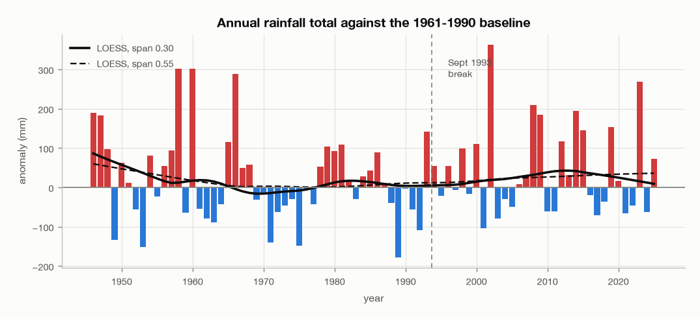
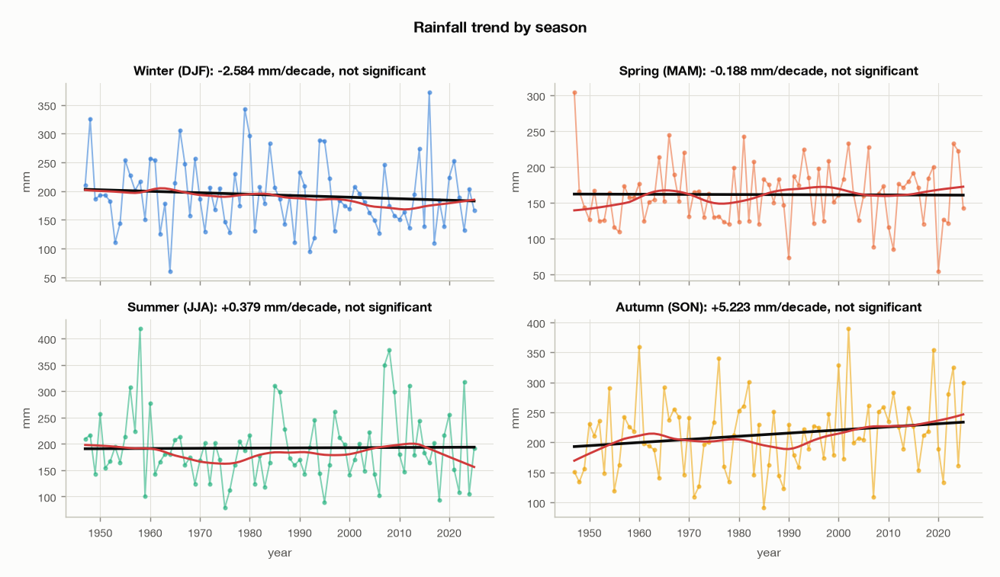
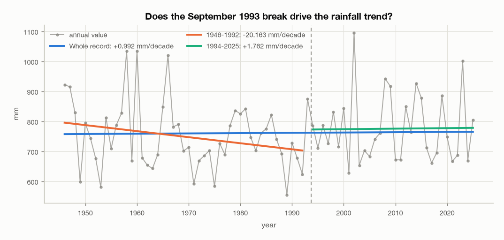
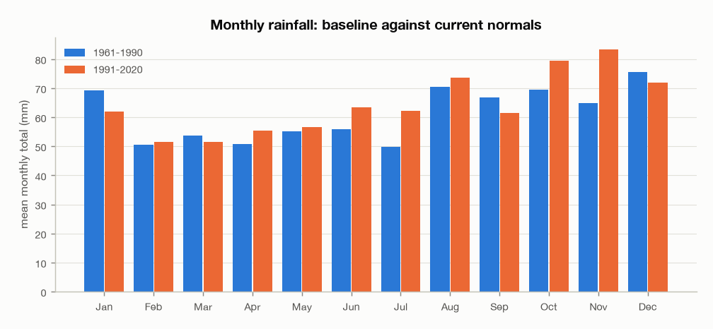
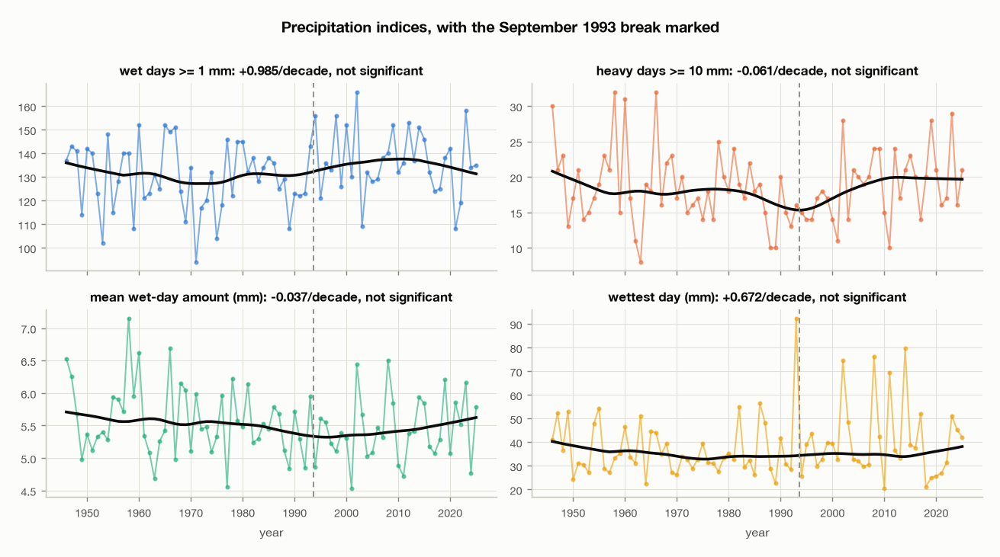

# Precipitation at Dublin Airport, 1946-2025: trends and anomalies

The third of three documents. It assumes the data-quality register in
[`01-data-review.md`](01-data-review.md) §10, in particular issue 2: the trace
precipitation flags were retired at the September 1993 observation-practice
change, which contaminates low-threshold wet-day counts and nothing else.

Anomalies are against the **1961-1990** WMO reference period. 2026 is partial
and is excluded throughout.

```
uv run EDA/scripts/eda_report.py --section precipitation
```

## The short version

**Nothing about rainfall at this station has changed detectably in eighty years.**

Every measure tested is statistically indistinguishable from no trend, and the
parametric and non-parametric tests agree on every one of them. That includes
the annual total, all four seasons, wet-day counts, heavy-day counts, rainfall
intensity, the wettest day of each year, the wettest hour of each year, and both
percentile-based extreme indices.

This is a real result, not a failure to find one. Dublin Airport's rainfall is
dominated by year-to-year variability that is large next to any underlying
change, and eighty years is not long enough to see through it.

Two things that look like findings and are not:

- **November rainfall is 28.5% higher in 1991-2020 than in 1961-1990.** It is not
  significant (p = 0.091), and neither is any other month.
- **The R99p extreme index is 48% higher across the same comparison.** Its trend
  over the full record is +0.61 mm per decade with p = 0.80.

The document sets out the evidence for the null, because a null claimed without
it is worthless.

## 1. Why this document uses totals

The review established that the September 1993 break is a **detection-threshold
change, not a measurement change**. Two thirds of the step lives in the single
0.1 mm bin, and hours recording more than 1 mm of rain differ across the
boundary by 0.0002 percentage points.

That determines what is allowed here:

| Measure | Crosses 1993 safely? |
|---|---|
| Annual and seasonal totals | Yes |
| Heavy-day counts (≥ 5, 10, 20 mm) | Yes |
| Rainfall intensity and extremes | Yes |
| Percentile indices R95p, R99p | Yes |
| Wet-day counts at 0.2 mm and 1 mm | **No, contaminated** |
| Dry and wet spell lengths | **No, they are defined by a threshold** |

The contaminated measures are still reported, with the caveat attached to each
rather than in a footnote. As it happens none of them shows a significant trend
either, so the caveat does not rescue a finding that would otherwise exist.

## 2. The annual series



The mean annual total over the record is about 762 mm. Year-to-year spread is
large: the wettest year on record is nearly double the driest.

| Decade | Mean (mm) | Anomaly vs 1961-1990 | Wettest year | Driest year |
|---|---|---|---|---|
| 1940s (4 years) | 816.3 | +83.5 | 1946, 921.7 | 1949, 598.3 |
| 1950s | 763.6 | +30.8 | 1958, 1033.9 | 1953, 580.6 |
| 1960s | 784.1 | +51.4 | 1960, 1034.3 | 1963, 642.9 |
| 1970s | 698.4 | -34.3 | 1979, 836.5 | 1975, 583.7 |
| 1980s | 746.3 | +13.6 | 1981, 842.2 | 1989, 555.1 |
| 1990s | 746.3 | +13.5 | 1993, 874.7 | 1992, 623.9 |
| 2000s | 796.8 | +64.0 | 2002, 1095.4 | 2001, 628.6 |
| 2010s | 771.9 | +39.1 | 2014, 927.2 | 2017, 661.6 |
| 2020s (6 years) | 763.0 | +30.3 | 2023, 1001.5 | 2021, 666.6 |

The decade means span 698 to 816 mm with no ordering. The 1970s are the driest
decade and the 1940s the wettest, on four years.

Machine-readable: `EDA/stats/03-annual-anomaly.csv`, `EDA/stats/03-decades.csv`.

## 3. Trends

Three estimates per series, as in the temperature document.

| Series | OLS per decade | p | Sen per decade | MK p | Significant? |
|---|---|---|---|---|---|
| Annual total | +0.99 mm | 0.86 | +0.84 mm | 0.84 | no |
| Winter (DJF) | -2.58 mm | 0.38 | -3.66 mm | 0.19 | no |
| Spring (MAM) | -0.19 mm | 0.93 | +1.08 mm | 0.57 | no |
| Summer (JJA) | +0.38 mm | 0.91 | -0.18 mm | 0.91 | no |
| Autumn (SON) | +5.22 mm | 0.094 | +5.33 mm | 0.111 | no |
| Wet days ≥ 1 mm | +0.99 days | 0.16 | +0.95 days | 0.21 | no |
| Heavy days ≥ 10 mm | -0.06 days | 0.82 | 0.00 days | 0.94 | no |
| Mean wet-day amount | -0.04 mm | 0.14 | -0.03 mm | 0.23 | no |
| Wettest day of the year | +0.67 mm | 0.32 | +0.12 mm | 0.83 | no |
| Wettest hour of the year | +0.01 mm | 0.98 | 0.00 mm | 0.95 | no |
| R95p total | -2.59 mm | 0.45 | -1.65 mm | 0.56 | no |
| R99p total | +0.61 mm | 0.80 | 0.00 mm | 0.90 | no |

**Twelve measures, no significant trend, and the two methods agree on all
twelve.** Autumn is the closest to significance at p = 0.094 and would need
another two decades of the same behaviour to establish itself.

The confidence interval on the annual total runs from -10.1 to +12.1 mm per
decade. That is the useful way to state the null: over eighty years the record
is consistent with anything between a 81 mm decline and a 97 mm rise, which
brackets zero comfortably but is not a tight bound. **The record does not show
that rainfall is unchanged; it shows that any change is too small to detect
against the variability.**



Applying the joint trend-plus-step model from the temperature document to the
annual total gives a step of +70.7 mm at September 1993 with p = 0.151. **Not
significant**, so unlike temperature the naive whole-record slope needs no
correction here.



Machine-readable: `EDA/stats/03-trends.csv`, `EDA/stats/03-break-test.csv`.

## 4. Is rain redistributing between months?

The annual total could be flat while the seasonal distribution changes
underneath it. Comparing the baseline against the current normals:



| Month | 1961-1990 | 1991-2020 | Change | Change % | p (Welch) | Significant? |
|---|---|---|---|---|---|---|
| January | 69.3 | 62.1 | -7.2 | -10.4% | 0.34 | no |
| February | 50.6 | 51.6 | +1.0 | +2.1% | 0.90 | no |
| March | 53.7 | 51.5 | -2.3 | -4.2% | 0.72 | no |
| April | 50.8 | 55.3 | +4.5 | +8.9% | 0.52 | no |
| May | 55.1 | 56.6 | +1.5 | +2.7% | 0.85 | no |
| June | 56.0 | 63.4 | +7.4 | +13.2% | 0.40 | no |
| July | 49.9 | 62.1 | +12.2 | +24.4% | 0.11 | no |
| August | 70.5 | 73.6 | +3.1 | +4.4% | 0.75 | no |
| September | 66.8 | 61.4 | -5.4 | -8.0% | 0.54 | no |
| October | 69.6 | 79.5 | +9.9 | +14.2% | 0.33 | no |
| November | 64.9 | 83.4 | **+18.5** | **+28.5%** | 0.091 | no |
| December | 75.6 | 71.9 | -3.7 | -4.9% | 0.69 | no |

**Not one month reaches significance.** This table is the clearest illustration
in the three documents of why a percentage change between two periods is not a
finding. November's +28.5% is the largest number on the page and the one a
reader's eye lands on; monthly rainfall is skewed and its year-to-year spread is
large enough that a difference that size arises by chance about one time in
eleven.

The pattern is at least internally consistent: the two biggest risers, November
and October, sit in the one season that came closest to a significant trend.
That is worth watching and is not worth reporting as a change.

Machine-readable: `EDA/stats/03-monthly-shift.csv`.

## 5. Intensity and extremes

The question behind these indices is whether the same annual total is arriving
in fewer, heavier bursts. It is not.



| Index | 1961-1990 | 1991-2020 | Change | Trend p |
|---|---|---|---|---|
| Annual total (mm) | 732.8 | 772.3 | +39.5 | 0.86 |
| Wet days ≥ 0.2 mm | 183.9 | 197.1 | +13.2 | contaminated |
| Wet days ≥ 1 mm | 128.5 | 136.9 | +8.4 | 0.16, contaminated |
| Heavy days ≥ 10 mm | 17.8 | 18.2 | +0.4 | 0.82 |
| Very heavy days ≥ 20 mm | 3.9 | 4.0 | +0.2 | — |
| Mean wet-day amount (mm) | 5.5 | 5.4 | -0.1 | 0.14 |
| Wettest day (mm) | 35.1 | 41.3 | +6.2 | 0.32 |
| R95p total (mm) | 151.4 | 163.3 | +11.9 | 0.45 |
| R99p total (mm) | 44.7 | 66.2 | **+21.6** | 0.80 |
| Longest dry spell (days) | 20.6 | 20.2 | -0.4 | contaminated |
| Longest wet spell (days) | 8.0 | 8.5 | +0.5 | contaminated |

R95p and R99p follow the standard definition: the annual rainfall falling on
days above the 95th and 99th percentile of wet-day amounts in the baseline
period, here 16.7 mm and 28.1 mm.

**R99p is the cautionary case.** Between the two periods it rises by 48%, which
would be a striking result about extreme rainfall. Fitted across the full
record its trend is +0.61 mm per decade with p = 0.80 and a Sen's slope of
exactly zero. The index is built on the handful of days per year above the 99th
percentile, so a single exceptional year moves the period mean a long way. The
era comparison and the trend disagree, and the trend is the one to believe.

**Mean wet-day amount is flat or very slightly falling**, at -0.04 mm per decade.
Combined with the flat heavy-day count, that closes off the "same rain, heavier
bursts" hypothesis at this station.

Machine-readable: `EDA/stats/03-indices.csv`.

## 6. Extremes register

| Rank | Wettest years | Driest years | Wettest months | Wettest days |
|---|---|---|---|---|
| 1 | 2002, 1095.4 mm | 1989, 555.1 mm | December 1978, 217.0 mm | **1993-06-11, 92.4 mm** |
| 2 | 1960, 1034.3 mm | 1953, 580.6 mm | December 2015, 193.5 mm | 2014-08-02, 79.6 mm |
| 3 | 1958, 1033.9 mm | 1975, 583.7 mm | August 2008, 189.9 mm | 2008-08-09, 76.1 mm |
| 4 | 1966, 1020.9 mm | 1971, 591.6 mm | November 2002, 185.8 mm | 2002-11-14, 74.6 mm |
| 5 | 2023, 1001.5 mm | 1949, 598.3 mm | November 1965, 182.3 mm | 2011-10-24, 69.5 mm |

The wettest hour on record is **26.5 mm on 2009-07-02 at 04:00 UTC**, narrowly
ahead of 25.0 mm on 1955-08-21. Both eras appear in the top five wettest hours,
which is a further check that the 1993 break does not touch heavy rainfall.

The wettest and driest year lists are mixed in time, unlike the temperature
equivalents: three of the five wettest years are from before 1970 and two from
after 2000.

Machine-readable: `EDA/stats/03-extremes.csv`.

## 7. What this document does not establish

- **That rainfall is unchanged.** It establishes that no change is detectable.
  The interval on the annual trend is wide, and a real change of up to about
  10 mm per decade in either direction would be invisible here.
- **Anything about wet-day frequency across 1993.** The trace-flag retirement
  makes the low-threshold counts incomparable, and no correction is attempted
  because the flag records occurrence rather than an amount that could be
  imputed.
- **Sub-daily intensity trends.** Hourly maxima are reported, but the record was
  not examined for changes in gauge type or integration period, which affect
  short-duration extremes more than daily ones.
- **Return periods.** Extreme rainfall design values need a fitted extreme-value
  distribution, not the percentile indices used here.
- **Anything about drought.** Dry-spell length is defined by a threshold and is
  contaminated by the 1993 break; a meaningful drought analysis would need a
  water-balance measure, not rainfall alone.

---

*Data: Met Éireann, Dublin Airport hourly observations, licensed
[CC BY 4.0](https://creativecommons.org/licenses/by/4.0/). Met Éireann does not
accept any liability for its use.*
