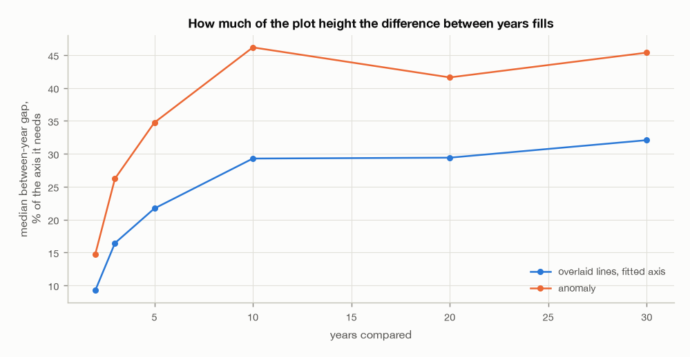
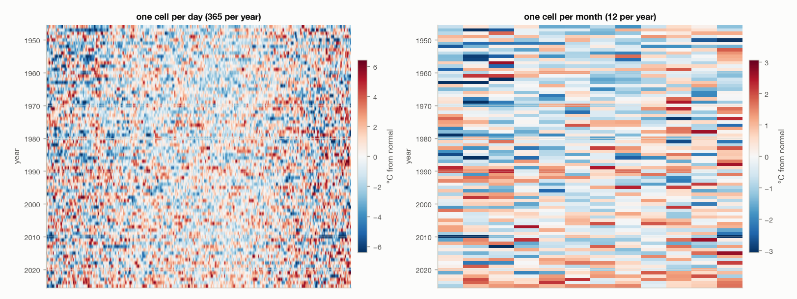

# 04. Which chart form to build next

This document exists to settle one open question: **what should the next chart in
the app be?** Six candidates are measured here against the real series, so the
choice rests on numbers rather than on which one sounds best.

**The choice was made on 20260912.** Put the question section 4.1 says flips the
recommendation - is the app for a handful of chosen years, or for surveying the
whole record? - the answer was **both**. Section 4.1 says those are not exclusive
and puts the cheaper to abandon first, so: small multiples now, the heatmap after.
The plan is `plans/20260912_2049-small-multiples-plan.md`, approved the same day.

Nothing below has been rewritten to suit that outcome. Section 4 still reads as
the recommendation it was, section 4.1 still says the question is the reader's
rather than the data's, and the forms not chosen keep the cases made for them.
The evidence has to stand on its own or it is not evidence.

Every number below comes from a CSV in `EDA/stats/`. Regenerate all of it with:

```
uv run EDA/scripts/eda_report.py --section forms
```


The panels deliberately do not share a year count: ten years overlaid and as
anomalies, the whole archive as a heatmap, and two years on a band. Each form is
drawn at the count it is meant for, because drawing the heatmap at ten years or
the envelope at eighty would show the form failing at a job nobody proposes for
it.

**Where the six come from.** Four were put to the user as the next chart. Two
more, **small multiples** and **a sequential colour ramp above roughly 24 years**,
were added from `plans/20260908_2230-multi-year-comparison-plan.md` §10 and §12,
where they sat as things considered and deferred during the multi-year build.
Leaving them out would have offered a choice narrower than the one the project
had already framed, and small multiples in particular turns out to matter.

Little of this set is new. That plan's §10 also names **the historical envelope**
and **a heatmap view**, so four of the six below were already on the project's
own deferred list; only the anomaly and the cumulative form are introduced here
for the first time.

Those same plan sections also list **overlaying two variables** and **URL state**.
Neither is here, deliberately: they are not answers to the question this document
asks, which is how to show many years of one variable. Overlaying two variables
is a different axis of the same chart and would face every problem measured in
section 1 unchanged.

---

## 1. What actually fails, and what does not

The app overlays one line per year on a shared January-to-December axis, on a
y-scale fixed to the variable's full range so that changing the year never
rescales the plot. Past a handful of years the result is unreadable. Being
precise about **why** is what separates the six candidates, because they fix
different things and only some fix the thing that is broken.

Four quantities, all on daily mean temperature, from
`EDA/stats/04-occlusion.csv` and `EDA/stats/04-axis-cost.csv`:

| Quantity | What it means | At ten years |
|---|---|---|
| Separation | median gap between the highest and lowest year on a given day | 7.22 °C |
| Spread | median standard deviation across years on a given day | 2.36 °C |
| Roughness | median day-to-day movement within one year | 1.20 °C |
| Swap rate | share of days on which a given pair of years changes which is on top | 25.8% |

Separation is a range, a maximum minus a minimum, and every window here is a
superset of the one before it, so it can only climb as years are added. That
climb is arithmetic and not a finding, which is why spread sits beside it: a
standard deviation across years has no such property. It rises from 1.51 °C at
two years, peaks at 2.43 °C at twenty, and eases back to 2.40 °C at thirty.

**Resolution is a real problem.** The app's fixed axis spans 45 °C, so a ten-year
selection's 7.22 °C of separation fills 16.0% of the plot height. An axis fitted
to what is actually drawn spans 24.67 °C and lifts that to 29.3%.

**Roughness is not the problem.** At 1.20 °C it is below the separation at every
year count tested, two included, so the lines are not lost in their own noise.

### Ordering is the problem, but not because the rate rises

The swap rate is flat. It is 28.0% at two years and 25.5% at thirty, slightly
*higher* at two. Taken alone that refutes the obvious story, because the app
plainly works at two or three years: if a quarter of days swapping were
disqualifying, it would disqualify two years as well.

What grows is not the rate but the number of pairs that can swap, and pairs grow
as N(N-1)/2. From `EDA/stats/04-occlusion.csv`:

| Years | Pairs on screen | Swap rate | Expected crossings per day |
|---|---|---|---|
| 2 | 1 | 28.0% | 0.28 |
| 5 | 10 | 25.6% | 2.56 |
| 10 | 45 | 25.8% | 11.63 |
| 20 | 190 | 25.2% | 47.83 |
| 30 | 435 | 25.5% | 111.00 |

That is the shape of the failure. Two lines crossing every fourth day is a chart;
thirty lines producing a hundred crossings a day is a texture. **The per-pair rate
never had to worsen for the form to fail, and no rescaling of the axis reduces a
single one of those crossings.**

### Subtracting a normal cannot help, and that is provable

Subtracting a day-of-year normal takes **the same number off every year on a
given day**, so it cannot change which year is above which. The swap rate is
computed twice in `EDA/stats/04-occlusion.csv`, once on raw values and once on
anomalies, so the claim is held to the data rather than asserted:

| Years | Swap rate, raw | Swap rate, anomaly |
|---|---|---|
| 2 | 28.022% | 28.022% |
| 10 | 25.844% | 25.844% |
| 30 | 25.517% | 25.517% |

Identical to three decimals, as it must be. **The anomaly buys resolution and
buys exactly nothing in occlusion.** That is not an argument against it; it is an
argument about which problem it solves.

### The app's own detail slider is a partial answer already

Every measurement above is at one point per day, and the app can resample to one
per week. Judging the line chart only at daily would test it at a resolution its
own README calls the fine end of the useful range for a wide selection, rather
than one it warns against. From
`EDA/stats/04-resolution.csv`, ten years:

| Step | Points per year | Spread | Swap rate | Crossings per pair per year |
|---|---|---|---|---|
| 1 day | 365 | 2.36 °C | 25.8% | 94.3 |
| 2 days | 182 | 2.10 °C | 32.6% | 59.3 |
| 4 days | 91 | 1.78 °C | 39.1% | 35.6 |
| 1 week | 52 | 1.61 °C | 40.2% | 20.9 |
| 4 weeks, past what the slider offers | 13 | 0.97 °C | 39.3% | 5.1 |

The rate and the count point opposite ways, and both are true. Coarser steps make
each remaining point *more* likely to swap, because averaging pulls the years
toward each other, but there are far fewer points, so the absolute tangle falls
by a factor of four and a half from daily to weekly. The cost is in the spread
column: it falls 32% over the same range. **The slider trades tangle for the difference you
came to see.** It helps, it is already built, and it does not remove the problem.

### It is not a fact about temperature, or about one decade

Six twenty-year windows spread across the record, three straddling September 1993
(`EDA/stats/04-anchor-sweep.csv`), hold the swap rate between 24.6% and 25.5%.
The anchor does not carry the finding.

Nor does the variable. From `EDA/stats/04-variables.csv`, ten years, daily:

| Variable | Aggregate | Swap rate, ties dropped | Swap rate, ties hold | Tied days |
|---|---|---|---|---|
| Mean sea level pressure | mean | 18.4% | 18.4% | 0.0% |
| Air temperature | mean | 25.8% | 25.8% | 0.1% |
| Mean wind speed | mean | 33.3% | 33.2% | 0.4% |
| Relative humidity | mean | 35.0% | 35.0% | 0.1% |
| Precipitation amount | sum | 36.3% | 29.5% | 18.5% |
| Visibility | mean | 36.3% | 36.3% | 0.2% |
| Sunshine duration | sum | 42.9% | 41.9% | 2.4% |

Temperature, which everything else here is measured on, has the second *lowest*
swap rate of the seven. Five of the other six tangle more, and only mean sea
level pressure tangles less, at 18.4%. So choosing temperature flattered the line
chart against most of the alternatives, though not against all of them.

Rain needs the two columns. On 18.5% of its day-pairs both years record exactly
nothing, and "which is on top" is then undefined. Dropping those days and
comparing what is left gives 36.3%; treating a tie as leaving the leader where it
was gives 29.5%. Both are defensible and the gap is nearly seven points, so the
rain figure is a range and not the precise fact a single column would imply.
Sunshine needs the same care on a smaller scale: 2.4% of its day-pairs are tied,
the second-largest share in the table, and its two columns sit 1.0 points apart.
The other five move by less than 0.2 points between them.

---

## 2. The six candidates, measured

### Anomaly: subtract the day-of-year normal

Each year plotted as its distance from the 1991-2020 normal for that day. From
`EDA/stats/04-separation.csv`:

| Years | Separation | Raw axis needed | % of axis | Anomaly axis | % of axis |
|---|---|---|---|---|---|
| 2 | 2.13 °C | 23.06 °C | 9.2% | 14.44 °C | 14.7% |
| 3 | 3.79 °C | 23.06 °C | 16.4% | 14.44 °C | 26.2% |
| 5 | 5.31 °C | 24.50 °C | 21.7% | 15.30 °C | 34.7% |
| 10 | 7.22 °C | 24.67 °C | 29.3% | 15.64 °C | 46.2% |
| 20 | 8.85 °C | 30.09 °C | 29.4% | 21.27 °C | 41.6% |
| 30 | 9.65 °C | 30.09 °C | 32.1% | 21.27 °C | 45.4% |

Separation is one column and not two because subtracting a normal cannot change
it: the same number comes off every year on a given day, so the gap between the
highest year and the lowest is untouched. What the anomaly buys is a narrower
axis to draw that gap on. Against the app's own fixed 45 °C axis ten years fill
16.0%; on the 15.64 °C axis an anomaly needs, they fill 46.2%, which is 2.9 times
the plot height for the same difference.



**Buys:** the largest resolution gain here, at every year count, and no new chart
type: the same lines against the same `Axis` contract, with zoom, detail and
opacity untouched.
**Costs:** nothing at all in occlusion, proven above. The top-right panel of the
figure is ten anomaly lines and it is as tangled as the raw panel beside it. It
also puts the reader one subtraction from the observation: a line at +3 °C no
longer says what the temperature was. And it is cheap but not as cheap as an
earlier draft of this section implied. The 2.9× is entirely the narrower axis, so
it arrives only if the app can draw that axis, and today it cannot: `meta.json`
carries one `min` and one `max` per variable, `VariableMeta` has no second range,
`axisFor` in `src/model/scales.ts` builds the axis from those two fields alone,
and `AppState` has no field saying which mode is showing. A second precomputed
range in the data contract and a mode flag threaded through the state layer are
part of the price, alongside the day-of-year normal and the subtraction.
**Best at:** two to five years, where few enough pairs exist for the lines to be
told apart and height is the whole difficulty.

### Small multiples: one small panel per year

The same line chart repeated, one year per panel, on a shared axis. From
`EDA/stats/04-small-multiples.csv`, on a 1200 × 520 px plot:

| Years | Grid | Panel size | Share of the area each year gets |
|---|---|---|---|
| 4 | 2 × 2 | 600 × 260 px | 25.0% |
| 10 | 4 × 3 | 300 × 173 px | 8.3% |
| 30 | 6 × 5 | 200 × 104 px | 3.3% |
| 80 | 9 × 9 | 133 × 58 px | 1.2% |

**Buys:** occlusion is gone by construction, exactly as for the heatmap, because
no two years share a panel. It keeps the y-axis and the line, so a value can
still be read off a panel rather than guessed from a colour.
**Costs:** comparing two years becomes looking from one panel to another instead
of at one line against another, which is what an overlay is for. Panel area falls
as one over the number of grid slots, which is 1/N only where the grid divides
evenly: ten years in a 4 × 3 grid leave two slots empty, so each panel gets 8.3%
and not 10%. At thirty years each panel is 200 × 104 px carrying 365 daily points,
which is 1.8 points per pixel: a sparkline whose shape reads but whose values do
not. It is **not** the free reuse of the existing chart it might look like, and
an earlier draft of this document claimed it was. `ChartView` in
`src/chart/adapter.ts` carries one x-range, one list of y-axes and one list of
series, and the adapter builds a single `grid` and captures pointer events for
one canvas, so N panels need either a multi-grid shape for that contract or N
synchronised instances, plus shared zoom. That is real work nobody here has
costed.
**Best at:** five to about fifteen years, where a panel is still a chart; to
thirty if the shape is all you need.

### Heatmap: years down, day of year across

One row per year, one column per day, colour carrying the value. From
`EDA/stats/04-heatmap-cells.csv`, same plot size:

| Years | Cells | Cell size |
|---|---|---|
| 10 | 3,650 | 3.3 × 52.0 px |
| 30 | 10,950 | 3.3 × 17.3 px |
| 80 | 29,200 | 3.3 × 6.5 px |

**Buys:** occlusion is gone by construction. It is the only candidate that stays
legible across the whole archive: at all 80 years each row is still 6.5 px tall
and the full width, where a small-multiple panel has shrunk to 133 × 58 px.

**What it does not buy, and this was claimed here before it was measured.** An
earlier draft of this document said the heatmap was the only form that makes the
+0.43 °C shift across eighty years visible. **That is false, and
`EDA/stats/04-heatmap-signal.csv` is the measurement that killed it.** Colour has
to compete with the noise in the cells, and the shift loses:

| Cell | Cells per year | Effective cells per row | Trend ÷ cell noise | One year ÷ row noise |
|---|---|---|---|---|
| 1 day | 365 | 70 | 0.17 | 1.62 |
| 1 week | 52 | 27 | 0.24 | 1.43 |
| 1 month | 12 | 10 | 0.39 | 1.44 |
| 1 season | 4 | 4 | 0.53 | 1.42 |

The left column is the eighty-year shift against the spread of cell values: 0.17
at one cell per day, rising to 0.53 at one per season. Aggregating helps, and
unlike an earlier version of this table it keeps helping all the way to the
coarsest cell tested. It still never gets close to 1. Four cells a year is
already too coarse to be a chart of the year at all, and even there the shift is
only half the noise of a cell, so the trend is not visible as colour at any cell
size worth drawing.

A check on that column, since it was wrong before: the trend itself does not
depend on cell size, so `trend_signal_c` in the CSV should be near-constant down
the four rows, and it is - 0.434, 0.433, 0.436, 0.433. It read 0.704 at one cell
per season until the cell that produced it was found to be a single day.

The right column is a different question with a different answer: a single year's
deviation against the noise of its own row, which the eye averages along. The
effective-cells column is why it is not simply the cell count: days in a row are
autocorrelated, one warm day following another, with a lag-1 of 0.68 at daily
cells, so a 365-cell row carries the information of about 70 independent ones.
The correction is this project's own, the same `n_eff = n(1 - r1)/(1 + r1)` that
`eda_common.fit_trend` applies throughout documents 1 to 3, and it takes the
daily ratio from 3.7 to **1.62**.

The noise in that denominator is the scatter of cells *within* a row, not the
scatter of the whole picture. Those are different numbers, and using the second
was a real error here until the eighth review pass: total variance splits as
pooled² = within² + between², so the pooled figure carries the between-year
variation that this ratio exists to detect, and putting the signal into its own
denominator understated the answer. By 1.8% at one cell per day and by 22.6% at
one per season, because within-row noise falls as cells coarsen and the
between-year term does not.

The honest claim is therefore narrower than it looked: **a heatmap makes an
unusual year findable across eighty years of record, but only just, at about 1.6
times the noise of its own row; and it does not make the slow trend visible at
all.** The slow trend is what document 2's fitted trends are for.

Cell size barely moves this: **1.62 against 1.42**, one cell per day against one
per season, with the two middle sizes between them and above the seasonal one. The
choice of cell size is close to free on this axis, and what actually costs a
factor of two is the autocorrelation correction above. An earlier version of this
paragraph read the other way, that finer cells were clearly better, and that was
an artefact of the wrong noise term.



**Costs:** a new chart type. Not as costly as that sounds, since the POC plan
(`plans/20260908_2031-weather-viewer-poc-plan.md` §5) chose ECharts partly
because it supports heatmaps natively, but still a new adapter path, a colour
scale, and a legend that no longer means what the chip list means. Reading a
value off a colour is far less precise than off an axis. None of zoom, detail or
opacity obviously survives: zoom acts on time and a heatmap's x-axis is a
canonical day of year; opacity exists to let overlapping lines show through,
which cells never do; and the detail slider resamples the series the line chart
draws, so a matrix would need a cell-size control of its own instead. The
cell-size measurements above are that question asked in advance.
**Best at:** thirty years and up, and uniquely at all eighty.

### Sequential ramp: keep the overlay, change the colours

Not a new chart, an encoding change: replace the decade hue with one ramp running
oldest to newest, so a tangle of lines reads as a gradient from old to recent.
Already endorsed for this purpose in
`plans/20260908_2230-multi-year-comparison-plan.md` §4 above roughly 24 years.

**Buys:** the cheapest change on this list, smaller even than the anomaly: it
touches `src/model/style.ts` and nothing else, *provided the ramp stays a
function of the absolute year*. `src/app/controls.ts` calls `styleForYear`
directly at two places to colour the strip ticks and the chips, and a ramp
stretched across the current selection instead would have to reach those too,
besides breaking the project's own rule that colour follows the entity and never
its rank. The multi-year plan §4 can be read either way and this document does
not settle it. It does not need the lines to be
individually followable, which is exactly the property the measurements above say
is unavailable, so it is the only candidate that accepts the tangle instead of
fighting it.
**Costs:** it removes nothing. Every crossing in the table above is still there,
and individual years become *less* identifiable, not more, since adjacent years
become near-identical colours. It answers "is there drift over time" and nothing
else.
**Best at:** twenty-four years and up, which is where the plan placed it, as a
cheap improvement to a form that will still be hard to read.

### Envelope: a percentile band with years on top

A 10th-to-90th percentile band over 1991-2020, selected years drawn over it.
From `EDA/stats/04-band-width.csv` and `EDA/stats/04-envelope-escape.csv`:

| Quantity | Value |
|---|---|
| Band width, median across the year | 5.83 °C |
| Band width, narrowest and widest day | 2.88 °C, 10.10 °C |
| Days outside the band, 2025 | 96 of 365 (26.3%) |
| Days outside the band, 2018 | 93 of 365 (25.5%) |
| Days outside the band, 2010 | 119 of 365 (32.6%) |
| Days outside the band, 1995 | 102 of 365 (27.9%) |
| Days outside the band, 1963 | 101 of 365 (27.7%) |

A typical year spends a quarter to a third of its days outside the band, so the
form has something to show rather than a rarity.

**Buys:** it solves occlusion by replacing most of the lines with a band, and
answers a question none of the others answer: *was this year unusual?*
**Costs:** one or two years on top before the tangle returns, so it does not
scale. It needs a reference period chosen and stated, and that choice moves every
count in the table.
**Best at:** one or two years against the climate, not years against each other.

### Cumulative totals: running sum through the year

Only meaningful for the two variables the app sums; a running total of a mean is
not a quantity. From `EDA/stats/04-cumulative.csv`:

| Variable | Window | Annual range | Spread by 1 July | Swaps per pair after 1 April |
|---|---|---|---|---|
| Rain | 2016-2025 | 662-1002 mm | 144 mm | 3.5 |
| Rain | whole series | 555-1095 mm | 350 mm | 3.5 |
| Sun | 2016-2025 | 1319-1648 h | 288 h | 3.4 |
| Sun | whole series | 1240-1740 h | 364 h | 3.4 |

**Buys:** integrating removes day-to-day roughness entirely, so curves are smooth
and a year's standing is readable at any point. Rainfall totals differ by a
factor of **2.0** across the archive; sunshine by **1.4**.
**Costs:** 2 of 13 variables. And the curves cross more than was previously
claimed here: **3.4 times per pair after 1 April**, averaged over the four rows,
so "they rarely cross" is wrong.
**Best at:** "how wet is this year so far", for rain and sunshine only.

---

## 3. Side by side

Three kinds of cell, kept apart, because a table giving a measured number and an
opinion the same weight hides which is which.

- **Bold** is measured and the CSV is named in section 2.
- *Judgement* is my assessment with nothing measured behind it. Every year-count
  range is one of these: the CSVs give pixel sizes, and turning a pixel size into
  "this is still readable" is a call, not a measurement.
- Plain text is a structural fact, true by what the form is. "A heatmap cannot
  show an exact value" needs no CSV, and neither does which parts of `ChartView`
  a form would have to change.

| | Anomaly | Small multiples | Heatmap | Sequential ramp | Envelope | Cumulative |
|---|---|---|---|---|---|---|
| Fixes resolution | **yes, 2.9×** | *judgement: yes* | not applicable | no | not argued below | *judgement: yes* |
| Fixes occlusion | **no, measured identical** | yes, by construction | yes, by construction | no | *judgement: yes, with 1-2 years drawn* | **partly, 3.4 swaps** |
| Years it works at | *judgement: 2-5* | *judgement: 5-15, 30 for shape only* | *judgement: 30-80* | *judgement: 24+* | *judgement: 1-2 over a band* | not measured |
| Variables covered | 12 of 13 | all 13 | 12 of 13 | all 13 | 12 of 13 | **2 of 13** |
| Exact values readable | yes | *judgement: yes to about 15 years, shape only past that* | no | yes | yes | yes |
| Needs a change to `ChartView` | no | yes, multi-grid | yes, a matrix | no | yes, a band series | no |
| Keeps zoom, detail, opacity | all three | *judgement: all three* | *judgement: none of the three* | all three | *judgement: all three* | *judgement: zoom only; detail becomes moot* |
| Build cost | *judgement: lowest* | *judgement: low* | *judgement: highest* | *judgement: lowest* | *judgement: medium* | *judgement: medium* |
| Answers | how did these few years differ | what did each year look like | which years were unusual, and when | is there drift over time | was this year unusual | how much so far |

Build cost is the row to be most sceptical of: nothing here measures it. Two
parts of the recommendation lean on it — taking the anomaly when the budget is
smallest, and building small multiples before the heatmap — while the choice
between those two is explicitly *not* made on cost. Section 4 says why.

Wind direction is the thirteenth variable, and it is the one that makes three
cells read "12 of 13". It is circular: `meta.json` types it `circular` and
`src/data/types.ts` says why, since a mean of 350° and 10° is 0° and not 180°.
Any form that subtracts a day-of-year normal or takes a percentile needs circular
statistics for it, which nothing in this project implements and nothing here
costs. That rules out the anomaly, the heatmap built on it, and the envelope's
band until someone writes them. The forms that only redraw or recolour the raw
series, small multiples and the sequential ramp, are untouched by this and really
do cover all thirteen.

The `ChartView` row is narrower than it looks. It asks only whether the adapter
contract changes shape, which is why the anomaly and the cumulative form both
score "no": each draws the same lines against the same `Axis`. Both still cost a
second precomputed range in `meta.json` and a mode flag in `AppState`, which is
real work in the layers below the chart. A "no" in that row is not a free form.

---

## 4. Recommendation

**Build small multiples.** ← recommended, but it is close, and section 4.1 names
the one question that flips it.

Two failures were measured, resolution and occlusion. Resolution has a cheap fix
and occlusion does not, so occlusion is what decides the form: it grows with the
number of pairs on screen rather than with any worsening of the lines themselves.
Two candidates remove it outright while still showing many years, small multiples
and the heatmap. The envelope removes it as well, but only by drawing one or two
years over a band, which is a different question rather than a way to compare
many years. Everything else here is either cheaper and no help against it, or an
answer to a different question.

Between those two, the argument for small multiples is **not** cost. An earlier
draft said it reuses the existing chart and is therefore cheaper; the code says
otherwise, and that claim is withdrawn in section 2. Both need a change to
`ChartView`, neither has been costed, and the honest position is that cost does
not separate them.

What separates them is what a reader can still do with the chart. Small multiples
keeps the y-axis and the line, so a value can be read rather than inferred from a
colour, and at ten years a panel is 300 × 173 px, which is a real chart. That
matters because of what the rest of the app is: the year strip rebuilt in
September lets a reader pick an arbitrary handful of years, and a handful is what
small multiples serves best. The years you pick are the panels you get.

**Build the heatmap second, or first if the goal is the whole archive.** It is
the only candidate that survives past thirty years, where small-multiple panels
have fallen to 133 × 58 px. Its second advantage is real but thin: an unusual
year reads as a row at **1.62 times** the noise of that row, once the
autocorrelation along the row is accounted for the way this project accounts for
it everywhere else. That is above 1 and not far above it. The other reason
previously given for the heatmap, that it alone makes the eighty-year trend
visible, was measured and is false.

**Take the anomaly whenever the budget is smallest.** It is the cheapest real
improvement, it is genuinely the best form at two to five years, and it composes
with either of the above. Choose it with open eyes: it will not make a ten-year
selection readable and section 1 proves that to three decimal places.

**Not recommended now.** The sequential ramp accepts the tangle rather than
fixing it, and is worth having only alongside a form that does. The envelope
answers a different question and should wait until someone wants to ask it. The
cumulative form covers 2 of 13 variables and its curves cross more than was
thought.

### 4.1 The question that flips this

**Is the app for comparing a handful of chosen years, or for surveying the whole
record?**

Everything above says small multiples if it is the first and the heatmap if it is
the second, and nothing in this data can answer it, because it is a question
about what the app is for. Two things lean toward the handful: the year strip
exists to pick arbitrary sets, and at thirty years a small-multiple panel is
already a sparkline while a heatmap row is still a full-width band. If the answer
is "both", they are not exclusive, and the order above is the cheaper-to-abandon
one first.

One more thing worth knowing before choosing: the app's detail slider already
takes some of the sting out of the overlay, cutting crossings per pair from 94 a
year to 21 at weekly. It costs 32% of the spread to do it. If that trade is
acceptable in practice, the case for building anything at all is weaker than the
rest of this document implies, and the anomaly alone may be enough.

### Two recommendations were overturned by measurement, including mine

An earlier session recommended the anomaly, on the grounds that it halves the
axis and is cheapest. Neither survives as stated. The axis shrinks by more than
half against the one the app actually draws, 2.9× at ten years, and by less than
half against a fitted one, 1.4× to 1.6× across the six year counts; "halves" is
not a number from either column. And "cheapest" was withdrawn in section 2 once
the code was read: the narrower axis has to come from somewhere, and nothing in
`meta.json` or `AppState` can supply it today. What was missing from that
recommendation is larger than either: the axis was never the binding constraint.

An earlier draft of **this** document then recommended the heatmap, partly
because it was "the only form on which a +0.43 °C shift across eighty years is
visible at all". Measuring that claim rather than asserting it showed the shift
is 0.17 to 0.53 times the cell noise and is not visible at any cell size. The
heatmap keeps a real and different advantage, finding an unusual year across the
whole record, though at 1.62 times the row noise rather than the 3.7 an
uncorrected count of cells suggested.

A fourth was found in the measurement rather than the prose. The column headed
"one year divided by row noise" was dividing by the noise of the whole heatmap,
not of the row, so it carried the between-year signal in its own denominator. The
figures it produced were too low throughout, worst where the document leaned on
them least carefully: 1.16 at one cell per season is really 1.42. The headline
moves from 1.59 to 1.62 and the conclusion is unchanged, but the claim that finer
cells are clearly better for spotting a year did not survive it.

A third claim of this document's own has since been withdrawn: that small
multiples is cheaper because it reuses the existing chart. `ChartView` carries
one grid, so it does not. Cost no longer separates the two forms, and the
recommendation now rests on what a reader can read off each.

Three figures from the earlier session's summary also failed re-measurement and
are corrected above: cumulative curves cross 3.4 times per pair after 1 April
rather than rarely, 2025 spends 96 days outside the band rather than 80, and the
+0.43 °C is suppressed by the 1993 step rather than inflated by it.

### What +0.43 °C actually is

Not a reason to build anything, on the evidence above, but it is quoted in this
project and the reasoning was wrong here before, so it is worth stating once.

The station changed how it observes in September 1993
(`EDA/01-data-review.md` §10), and it would be easy to assume that inflates the
figure. It does not. Document 2 fits trend and step together and puts the step at
**-0.262 °C**, a cooling offset (`EDA/stats/02-break-test.csv`), which holds the
whole-series number **down**. From `EDA/stats/04-warming-signal.csv`:

| Window | Measured | Centres apart | Trend alone | Difference |
|---|---|---|---|---|
| 1946-1975 against 1996-2025 | +0.43 °C | 50 years | +0.73 °C | -0.29 °C |
| 1994-2008 against 2011-2025 | +0.22 °C | 17 years | +0.25 °C | -0.03 °C |

Using document 2's fitted +0.145 °C per decade, the whole-series comparison falls
0.29 °C short of trend, which is the step almost exactly; the comparison that
never crosses 1993 falls short by 0.03 °C, which is nothing. The smaller +0.22 °C
is not a cleaner measurement of the same thing, it is a shorter window, and
comparing them as though they measured the same quantity was the error. One
honest qualifier: on the annual mean alone the step is not significant, p = 0.24,
interval -0.706 to +0.182, which does not exclude a warming step. The sign comes
from document 2's hour-by-hour decomposition, not from that test.

---

## 5. What this document does not decide

- **The colour scale**, if the heatmap is chosen. Diverging around a normal is
  one candidate, and the cell-noise measurement above is the constraint on any of
  them. This document does not choose between them.
- **What happens to the year strip** under a heatmap of all eighty years, which
  needs no year selection at all, and under small multiples, which needs one.
- **Whether forms coexist** behind a switch or replace one another.
- **Build cost**, which nothing here measures and which the recommendation uses.
- **Anything about the 1993 discontinuity beyond stating it.** No correction is
  applied anywhere in this project, deliberately.

## 6. Provenance

| File | Holds |
|---|---|
| `EDA/stats/04-separation.csv` | separation and axis span, raw and anomaly, by year count |
| `EDA/stats/04-axis-cost.csv` | what the app's fixed axis costs against a fitted one |
| `EDA/stats/04-occlusion.csv` | spread, roughness, pair counts and the swap rate, raw and anomaly |
| `EDA/stats/04-anchor-sweep.csv` | the same measures from six windows across the record |
| `EDA/stats/04-resolution.csv` | what the detail slider does to spread and to crossings |
| `EDA/stats/04-variables.csv` | the swap rate for seven variables, and tied days |
| `EDA/stats/04-small-multiples.csv` | panel size and area share by year count |
| `EDA/stats/04-heatmap-cells.csv` | cell counts and cell size at a real plot size |
| `EDA/stats/04-heatmap-signal.csv` | whether the trend, and whether one year, beats the cell noise |
| `EDA/stats/04-warming-signal.csv` | first-to-last difference, the gap it spans, and what the trend implies |
| `EDA/stats/02-break-test.csv` | document 2's joint trend-plus-step fit, read at runtime, not copied |
| `EDA/stats/04-band-width.csv` | the 10-90 band's width |
| `EDA/stats/04-envelope-escape.csv` | days a year spends outside the band |
| `EDA/stats/04-cumulative.csv` | annual totals, mid-year spread, crossing counts |
| `EDA/figures/04-forms.png` | four forms, each at the year count it is for |
| `EDA/figures/04-separation.png` | separation as a share of the axis, by year count |
| `EDA/figures/04-heatmap-detail.png` | eighty years of anomaly at two cell sizes |

All of it is regenerated by `uv run EDA/scripts/eda_report.py --section forms`,
and the output is deterministic: two runs produce byte-identical files, so a
number that moves shows up as a git diff rather than as drift between the prose
and the data.
