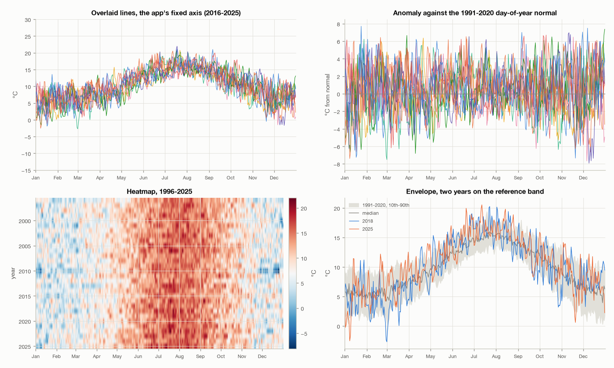

# 04. Which chart form to build next

This document exists to settle one open question: **what should the next chart in
the app be?** Four forms were proposed. Each is measured here against the real
series so the choice rests on numbers rather than on which one sounds best.

**No choice has been made.** The recommendation at the end is a recommendation.
The decision is the user's, and the project convention is that a plan in
`plans/` is written and approved before any of this is built.

Every number below comes from a CSV in `EDA/stats/`. Regenerate all of it with:

```
uv run EDA/scripts/eda_report.py --section forms
```



---

## 1. What actually fails, and what does not

The app overlays one line per year on a shared January-to-December axis, on a
y-scale fixed to the variable's full range so that changing the year never
rescales the plot. Past a handful of years the result is unreadable. Before
choosing a replacement it is worth being precise about **why**, because the four
forms fix different things and only some of them fix the thing that is broken.

Three quantities, all measured on daily mean temperature, in
`EDA/stats/04-occlusion.csv` and `EDA/stats/04-axis-cost.csv`:

| Quantity | What it means | Value |
|---|---|---|
| Separation | median gap between the highest and lowest year on a given day, at ten years | 7.22 °C |
| Roughness | median day-to-day movement within a single year | 1.20 °C |
| Swap rate | share of days on which a given pair of years changes which is on top | 25.9% |

**Resolution is a real problem.** The app's fixed axis spans 45 °C, so a ten-year
selection's 7.22 °C of separation fills 16.0% of the plot height. An axis fitted
to what is actually drawn spans 24.67 °C and lifts that to 29.3%.

**Roughness is not the problem.** At 1.20 °C it is smaller than the separation at
every year count from three upwards, so the lines are not simply lost in their
own noise.

**Ordering is the problem.** Any two years change places on about a quarter of
all days, and that figure barely moves between two years (28.0%) and thirty
(25.5%). A line cannot be followed by its position when it changes position on
one day in four. This is what the top-left panel of the figure shows and it is
why more plot height, on its own, does not rescue the form.

### The measurement that decides it

Subtracting a day-of-year normal takes **the same number off every year on a
given day**. It therefore cannot change which year is above which. The swap-rate
column is computed twice in `EDA/stats/04-occlusion.csv`, once on raw values and
once on anomalies, precisely so this is held to the data rather than asserted:

| Years | Swap rate, raw | Swap rate, anomaly |
|---|---|---|
| 2 | 28.022% | 28.022% |
| 10 | 25.856% | 25.856% |
| 30 | 25.525% | 25.525% |

Identical to three decimals, as it must be. **The anomaly form buys resolution
and buys exactly nothing in occlusion.** That is not an argument against it. It
is an argument about which problem it solves.

---

## 2. The four forms, measured

### Anomaly: subtract the day-of-year normal

Each year is plotted as its distance from the 1991-2020 normal for that day.
From `EDA/stats/04-separation.csv`:

| Years | Separation | Raw axis needed | % of axis | Anomaly axis | % of axis |
|---|---|---|---|---|---|
| 2 | 2.14 °C | 23.06 °C | 9.3% | 14.44 °C | 14.8% |
| 3 | 3.79 °C | 23.06 °C | 16.4% | 14.44 °C | 26.2% |
| 5 | 5.31 °C | 24.50 °C | 21.7% | 15.30 °C | 34.7% |
| 10 | 7.22 °C | 24.67 °C | 29.3% | 15.64 °C | 46.2% |
| 20 | 8.85 °C | 30.09 °C | 29.4% | 21.27 °C | 41.6% |
| 30 | 9.65 °C | 30.09 °C | 32.1% | 21.27 °C | 45.4% |

Against the app's own fixed 45 °C axis the gain is larger still: 16.0% to 46.2%
at ten years, which is 2.9 times the plot height for the same difference.

**Buys:** the largest resolution gain of the four, at every year count. Cheapest
to build by a wide margin: a build-time day-of-year normal in `meta.json` and a
subtraction in the model. No new chart type, no adapter change, and the existing
zoom, detail and opacity controls keep working untouched.
**Costs:** nothing at all in occlusion, as shown above. The top-right panel of
the figure is ten anomaly lines and it is as tangled as the raw panel beside it.
It also puts the reader one subtraction away from the observation: a line at
+3 °C no longer says what the temperature was.
**Best at:** two to five years, where the lines can still be told apart by colour
and the extra height is the whole difficulty.

### Heatmap: years down, day of year across

One row per year, one column per day, colour carrying the value. From
`EDA/stats/04-heatmap-cells.csv`, on a 1200 × 520 px plot:

| Years | Cells | Cell size |
|---|---|---|
| 10 | 3,660 | 3.3 × 52.0 px |
| 30 | 10,980 | 3.3 × 17.3 px |
| 81 | 29,646 | 3.3 × 6.4 px |

**Buys:** occlusion is gone by construction, because no two years share a pixel.
It is the only one of the four that can show the whole archive at once, and at 81
years each row is still 6.4 px tall. It is also the only form that makes the
long-run signal visible: the difference between the first and last thirty years
is **+0.43 °C** (`EDA/stats/04-warming-signal.csv`), which is 0.96% of the app's
fixed axis, or about five pixels on a 520 px plot. On a line chart that is
invisible. As a shift in colour across 80 rows it is not.
**Costs:** a genuinely new chart type, so it is the most work. Reading a value
off a colour is far less precise than reading it off an axis, so it answers
"which years were warm, and when" rather than "how warm was 14 June 2011".
Sub-daily detail cannot survive it, so the detail slider becomes meaningless
below one point per day.
**Best at:** ten years and up, and uniquely at all 81.

**The long-run number carries a caveat.** The station changed how it observes in
September 1993 (`EDA/01-data-review.md` section 10). Measured only within the
post-1993 era the first-to-last-fifteen-years difference is **+0.22 °C**, half
the whole-series figure. Some of the +0.43 °C is the instrument, not the climate.
A heatmap will show the 1993 step as a horizontal seam, which is honest, and the
footer already says so.

### Envelope: a percentile band with years on top

A 10th-to-90th percentile band over 1991-2020, with selected years drawn over it.
From `EDA/stats/04-band-width.csv` and `EDA/stats/04-envelope-escape.csv`:

| Quantity | Value |
|---|---|
| Band width, median across the year | 5.83 °C |
| Band width, narrowest day | 2.88 °C |
| Band width, widest day | 10.10 °C |
| Days outside the band, 2025 | 96 of 365 (26.3%) |
| Days outside the band, 2018 | 93 of 365 (25.5%) |
| Days outside the band, 2010 | 119 of 365 (32.6%) |
| Days outside the band, 1963 | 101 of 365 (27.7%) |

A typical year spends between a quarter and a third of its days outside the
band, so the form has something to show: the excursions are frequent enough to
be the point rather than a rarity.

**Buys:** it solves occlusion by replacing most of the lines with a band, and it
answers a question none of the others answer directly: *was this year unusual?*
The bottom-right panel of the figure reads cleanly.
**Costs:** it only carries one or two years on top before the tangle returns, so
it does not scale; it is a different question, not a better answer to the same
one. It needs a reference period decided and stated, and the choice of period
changes every excursion count.
**Best at:** one or two years against the climate, not years against each other.

### Cumulative totals: running sum through the year

Only meaningful for the two variables the app sums. The other eleven are
averaged, and a running total of a mean is not a quantity. From
`EDA/stats/04-cumulative.csv`:

| Variable | Window | Annual range | Spread by 1 July | Order swaps per pair, after 1 April |
|---|---|---|---|---|
| Rain | 2016-2025 | 662-1002 mm | 144 mm | 3.5 |
| Rain | whole series | 555-1095 mm | 350 mm | 3.5 |
| Sun | 2016-2025 | 1319-1648 h | 288 h | 3.4 |
| Sun | whole series | 1240-1740 h | 364 h | 3.4 |

**Buys:** integrating removes the day-to-day roughness entirely, so the curves
are smooth and a year's standing is readable at any point. Annual totals differ
by a factor of two across the archive, which is a large, real signal.
**Costs:** it covers 2 of 13 variables. And the curves are not as well behaved as
was previously claimed here: a pair swaps order **3.5 times after 1 April**, so
"they rarely cross" is wrong.
**Best at:** the question "how wet is this year so far", for rain and sunshine
only.

---

## 3. Side by side

| | Anomaly | Heatmap | Envelope | Cumulative |
|---|---|---|---|---|
| Fixes resolution | **yes, 2.9×** | not applicable | yes | yes |
| Fixes occlusion | **no, measured** | yes, by construction | yes | partly, 3.5 swaps |
| Years it supports | 2-5 | 10-81 | 1-2 over a band | 5-10 |
| Variables it covers | all 13 | all 13 | all 13 | **2 of 13** |
| Exact values readable | yes | no | yes | yes |
| Keeps zoom, detail, opacity | yes | detail becomes moot | yes | detail becomes moot |
| Build cost | **lowest**: a normal plus a subtraction | highest: a new chart type | medium | medium |
| Answers | how did these few years differ | which years were warm, and when | was this year unusual | how much so far |

---

## 4. Recommendation

**Build the heatmap.** ← recommended

The app's stated purpose is comparing years, and the measured reason it fails at
that is ordering, not height: any two years change places on a quarter of all
days, at every year count. The heatmap is the only one of the four that removes
that problem rather than rescaling around it, the only one that shows all 81
years at once, and the only one that makes a +0.43 °C shift across eighty years
visible at all. It is also the most work, and that is the real cost of this
recommendation.

**Then, or instead if the budget is small: the anomaly.** It is the cheapest
thing on this list by a wide margin and it is genuinely the best form for two to
five years, which is plausibly the most common use. It should be chosen with
open eyes: it will not make a ten-year selection readable, and the measurement in
section 1 says so in the strongest terms available, by showing the crossing rate
is unchanged to three decimal places.

The two are complementary rather than competing, and they share a build-time
artefact: the heatmap wants a diverging colour scale centred on something, and
the day-of-year normal the anomaly needs is the natural centre. Building the
normal first serves both.

**Not recommended now:** the envelope answers a different question and should
wait until someone actually wants to ask it; the cumulative form covers 2 of 13
variables and its curves cross more than was thought.

### This differs from the previous recommendation, and why

An earlier session recommended the anomaly first, on the grounds that it halves
the axis and is cheapest. Both halves of that are confirmed here. What was
missing is that the axis was never the binding constraint. Two of that session's
other figures did not survive re-measurement either, and are corrected above:
cumulative curves cross 3.5 times per pair after 1 April rather than rarely, and
2025 spends 96 days outside the 10-90 band rather than 80.

---

## 5. What this document does not decide

- **The colour scale**, if the heatmap is chosen. Diverging around a normal is
  the obvious choice and is not measured here.
- **What happens to the year strip.** A heatmap of all 81 years does not need a
  year selection at all, which touches a control that was just rebuilt.
- **Whether the forms coexist** as a switch, or replace one another.
- **Anything about the 1993 discontinuity beyond stating it.** No correction is
  applied anywhere in this project, deliberately.

## 6. Provenance

| File | Holds |
|---|---|
| `EDA/stats/04-separation.csv` | separation and axis span, raw and anomaly, by year count |
| `EDA/stats/04-axis-cost.csv` | what the app's fixed axis costs against a fitted one |
| `EDA/stats/04-occlusion.csv` | roughness and the swap rate, raw and anomaly |
| `EDA/stats/04-warming-signal.csv` | first-to-last difference, whole series and post-1993 |
| `EDA/stats/04-heatmap-cells.csv` | cell counts and cell size at a real plot size |
| `EDA/stats/04-band-width.csv` | the 10-90 band's width |
| `EDA/stats/04-envelope-escape.csv` | days a year spends outside the band |
| `EDA/stats/04-cumulative.csv` | annual totals, mid-year spread, crossing counts |
| `EDA/figures/04-forms.png` | the same ten years in all four forms |
| `EDA/figures/04-separation.png` | separation as a share of the axis, by year count |

All of it is regenerated by `uv run EDA/scripts/eda_report.py --section forms`,
and the output is deterministic: two runs produce byte-identical files, so a
number that moves shows up as a git diff rather than as drift between the prose
and the data.
